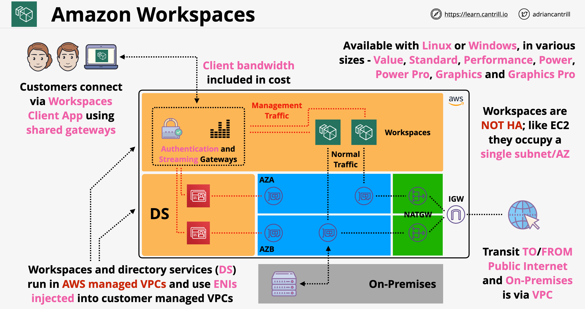

# Amazon Workspaces

- Managed desktop as a service product (DAAS)
- Ideal for home working
- Similar to Citrix/Remote Desktop
- It provides a consistent desktop accessible from anywhere, we can log off and log back in from different places, applications maintaining their state
- We can have Windows and Linux workspaces in various sizes
- We can use commercial applications on the workspaces
- Workspaces can be charged on monthly or hourly basis. There is an additional monthly infrastructure cost, which is applied event in case when we are billed hourly
- Workspaces use Directory Service (Simple, AD, AD Connector) for authentication and user management
- Each workspace uses an ENI injected in a VPC
- Workspaces are accessed using client software from desktop/laptop, bandwidth is included free of charge. For any other internet access from the workspaces normal VPC infrastructure is used and charged accordingly
- Windows workspaces can access FSx and EC2 windows resources
- Any existing hybrid network can be also utilized for accessing on-premise resources
- Workspaces provide a system volume and an user volume, both can be encrypted

## Workspaces Architecture

- Workspaces inject an ENI into customer managed VPCs, they run into AWS managed VPCs
- Directory services also inject ENIs into customer managed VPCs for file access, etc.
- Workspaces are not highly available by design
- We can distribute workspaces in different AZs, but a single workspace in particular can be affected by an AZ failure
