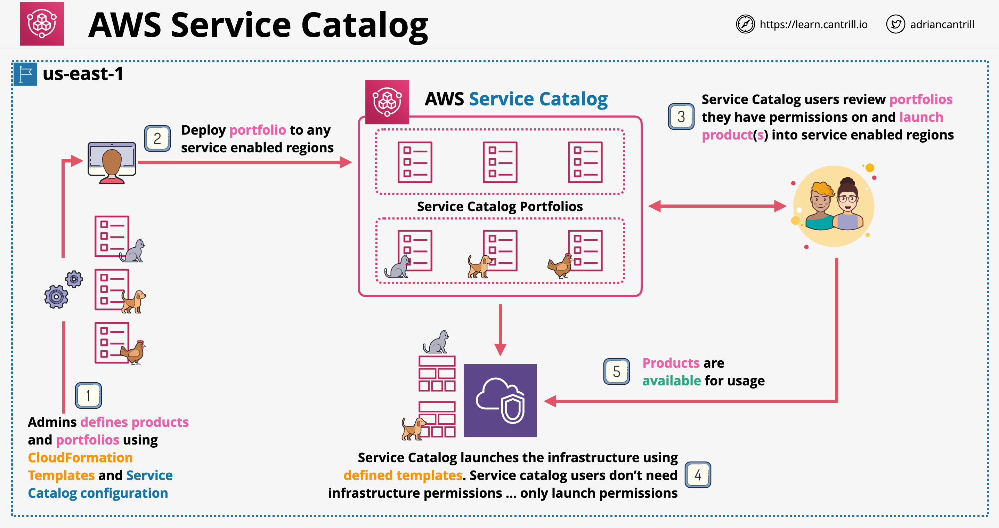

# AWS Service Catalog:
- Enables organizations to create and manage catalogs of IT services that are approved for AWS. 
- IT services (called Products) can include everything from virtual machine images, servers, software, and databases to complete multi-tier application architectures. 
- You create a product by importing an AWS CloudFormation template. 
- A "Provisioned Product" is a CloudFormation stack.
- A Portfolio is a collection of products, together with configuration information.
- When a user launches a product that has an IAM role assigned to it, AWS Service Catalog uses the role to launch the product's cloud resources using AWS CloudFormation. 

- Portal for end users who can launch predefined products by admins
- End user permissions can be controlled
- Admins can those products using CloudFormation and the permissions required to launch them
- Admins build products into portfolios which are made visible to the end users
- Service Catalog architecture:
    