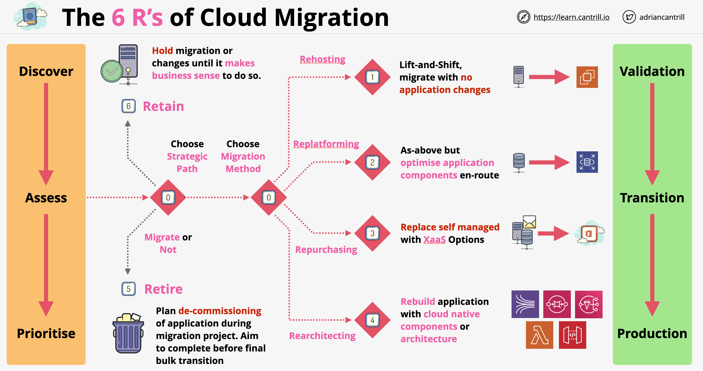

# The 7 Rs of application migration:
	- Rehost (lift and shift): Move an application to the cloud without making any changes: from a VM/Server to an EC2 instance.
	- Relocate (hypervisor-level lift and shift): This migration scenario is specific to VMware Cloud on AWS, which supports VM workload portability between your on-premises environment and AWS.
	- Replatform (lift and reshape): Move an application to the cloud by taking advantage of cloud capabilities like PaaS. For example, migrate your on-premises Oracle database to Amazon RDS for Oracle.
	- Refactor (re-architect) – Move an application and modify its architecture by taking full advantage of cloud-native features to improve agility, performance, and scalability.
	- Repurchase (drop and shop) – Change to a different product, typically by moving from a traditional application to a software as a service (SaaS) product.
	- Retain (revisit) – Keep applications in your source environment, at least temporarily.
	- Retire – Decommission or remove applications that are no longer needed in your source environment.

## Rehosting

- Lift and shift or migrate as is: move the application with the least amount of changes into the cloud
- Generally used with legacy or monolithic applications
- Reasons to do application rehosting:
    - Reduce admin overhead using IaaS
    - Potentially easier to optimize the application when is running in the cloud compared to working with legacy tooling
    - Cost savings, consuming a certain type of instances
- Negatives:
    - We wont be able to take advantage of the full Cloud offerings
    - Potentially "kicking the can down the road" - delaying what we can do today until tomorrow
- For doing rehosting we can use VM Import/Export tools and Server Migration Service

## Replatforming

- Similar to rehosting with the addition of applying certain optimizations to the applications as part of the migration process
- We might decide to use RDS instead of self-managed database instances
- We might use ELB's instead of self managed load balancers
- We might use S3 as a backup or media storage
- Replatforming approach brings no real negatives but also no world-changing benefits
- Potential benefits of migration:
    - Admin overhead reduction
    - Performance benefits
    - More effective backups
    - Improved HA/FT

## Repurchasing

- Unless we have a reason to use self-managed application, we would rather use XaaS products
- Examples of this kind of migrations:
    - MS Exchange => Microsoft 365
    - Self managed CRM => SalesForce
    - Self managed payroll => Xero
- Using a managed service reduces admin overhead, costs and risks. Almost always a preferred option

## Refactoring / Re-architecting

- Requires a full review of the architecture of an application
- The aim is to adopt cloud-native architecture and products
- We might look at adopting service-origin and microservice based architectures
- We might adopt a more API based architecture, event-driven architecture or serverless architecture
- This approach is initially very expensive and time-consuming
- In the long term it does offer the best benefits compared to other types of migrations

## Retire

- Systems are often running for no reasons
- Auditing their usage is often more work than leaving them to run
- A migration is perfect time to re-evaluate the usefulness of an application. If we don't need it, we should switch if off
- Often saves 10% to 20% cost in case of large scale migration

## Retain

- Essentially do nothing
- For some application the usage is uncertain with some complicating factors against being able to retire it or migrate it to the cloud
- In other cases some old applications might have some usage, but it wont worth the effort to move them to the cloud
- Or we might have a complex application - leave it till later
- Super-import application - risky to move
- The best advice is to complete the migration of other applications and swing back to focus on the left-overs

## 6R Migration Plan

# Server/Application Migration Options:

AWS Application Discovery Service:
- Helps you plan your migration to the AWS cloud by collecting usage and configuration data about your on-premises servers.
- Integrated with AWS Migration Hub.
- You can view the discovered servers, group them into applications, and then track the migration status of each application from the Migration Hub console
- You can export the system performance and utilization data for your discovered servers into your cost model to compute the cost of running those servers in AWS. 
- You can export data about the network connections that exist between servers. This information helps you determine the network dependencies between servers and group them into applications for migration planning. 
- Agentless discovery: can be performed by deploying the AWS Agentless Discovery Connector (OVA file) through your VMware vCenter.
- Agent-based discovery can be performed by deploying the AWS Application Discovery Agent on each of your VMs and physical servers. 

## Application Discovery Service (AMS)

- Allows us to discover on-premises infrastructure:
    - What VM we have
    - What CPU and memory they are allocated
    - MAC addresses
    - Resource utilization
    - etc.
- It also tracks these properties over time for more effective migration
- AMS runs in 2 modes:
    - Agentless (Application Discovery Agentless Connector): 
        - OVA appliance integrating with VMWare
        - Measures performance and resource usage, information which can be obtained from the outside of a VM
    - Agent Based mode: offers additional information from inside of a VM
        - Offers data gathering for network, processes, performance
        - We can see applications running on a VM
        - We can even see dependencies between VM based on network activity
- AMS integrates with AWS Migration Hub and Athena
- **AWS Migration Hub**: tracks migrations of different types in AWS

# AWS Server Migration Service (SMS):
- An agentless service that automates the migration of your on-premises VMware vSphere, Microsoft Hyper-V/SCVMM, and Azure virtual machines to the AWS Cloud. 
- Uses the Server Migration Service Connector which is a FreeBSD VM that you install in your on-premises virtualization environment. 
- Incrementally replicates your server VMs (snapshots) as cloud-hosted AMIs ready for deployment on Amazon EC2. 
- You can schedule replications and track progress of a group of servers that constitutes an application. 
- Supports Windows and Linux.
- Limit: 50 concurrent VM migrations per account.

# CloudEndure Migration:
- An agent-based tool that rehosts your applications on AWS.
- Supports self-service, highly automated, lift-and-shift migrations with minimal business disruption. 
- You install the CloudEndure Agent on your source machines.
- The Agent replicates your applications and data in a staging area on AWS.
- After the initial replication, the CloudEndure Agent tracks and migrates changes from your source environment to the target staging area by using asynchronous, block-level data replication, without causing downtime or affecting performance.

