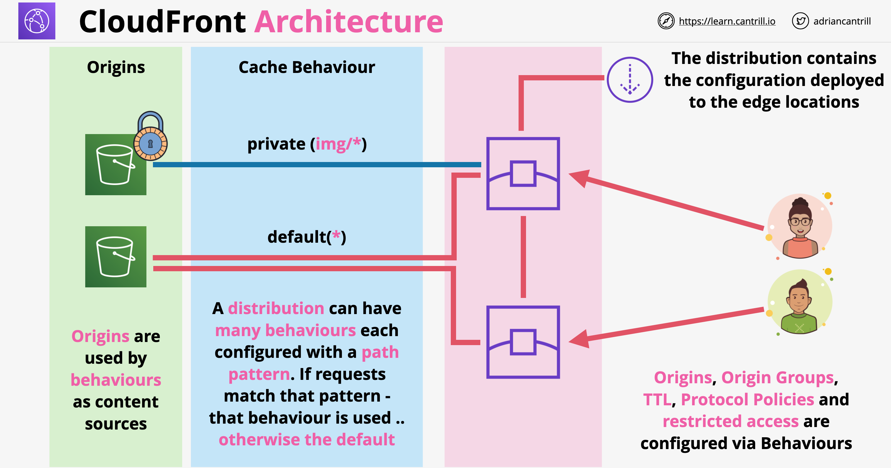

# AWS CloudFront
- CDN using a global network of 225+ edge locations.
- Two levels of edge locations:
	- Point-Of-Presence (POP): close to the end user (low latency). 
	- Regional Edge Caches: higher level cache. Have a much larger caching capacity than POPs. 
- Supports static, dynamic, interactive and streaming content.
- Common video formats are MPEG DASH, Apple HLS, Microsoft Smooth Streaming, and CMAF. 
- Supports WebSockets also.
- You create a CloudFront distribution to tell CloudFront how to distribute your content.
- A Distribution defines:
	- Delivery methods: Web, VoD, Live Streaming.
	- You content origin: S3 bucket, EC2 and ELB or any HTTP service.
	- Access: open or restricted.
	- Security: HTTP or HTTPS.
	- Cache key.
	- Origin request settings: parameters of the request sent by CloudFront to your content origin. 
	- Geo-restrictions: prevent users in selected countries from accessing your content. Can be an allow-list or a deny-list.
- For RTMP distributions, you must store your content on S3.
- Cache Key:
	- Uniquely identifies each file in the cache for a given distribution. 
	- Determines whether a viewer request results in a cache hit.
	- Values included in the cache key can be HTTP request query strings, headers, and cookies. 
	- By default CloudFront does not consider cookies nor headers. You can change this.
- Origin Requests:
	- These are the HTTP requests sent by CloudFront to the content origin when you have a cache miss.
	- Even when you want to cache based on specified query parameters, CloudFront will forward the whole query string to the origin.
	- All HTTP headers and cookies that you include in the cache key are also automatically included in origin requests. 
	- CloudFront can add URL query parameters and HTTP headers to origin requests. Eg: CloudFront-Viewer-Country header.
- Policies:
	- control the cache key, the origin request and the HTTP headers.
	- For origin requests, you can use managed policies, or you can create your own.
- Cache expiration:
	- By default, each file automatically expires after 24 hours.
	- To change the cache duration for all files that match the same path pattern, you can change the CloudFront settings for Minimum TTL, Maximum TTL, and Default TTL.
	- To change the cache duration for an individual file, you can configure your origin to add a Cache-Control max-age or Cache-Control s-maxage directive, or an Expires header field to the file.
	- Cache-Control s-maxage directive: consumed by CloudFront only.
	- Cache-Control max-age directive: consumed by the browser. Takes precedence on the « Expires » directive. Consumed also by CloudFront if « Cache-Control s-maxage » is not specified.
	- In case both Maximum TTL and max-age are set, CloudFront caches objects for the lesser of the two values (AND operator). 
- If you need to remove a file from CloudFront edge caches before it expires, you can do one of the following:
	- Invalidate the file from edge caches. The next time a viewer requests the file, CloudFront returns to the origin to fetch the latest version of the file.
	- Use file versioning to serve a different version of the file that has a different name. This is the recommended method.
- Origin Failover capability: automatically serves content from a backup origin when the primary origin is unavailable. 
- Origin Access Identity (OAI) feature: OAI is a special CloudFront user to which you grant access to your S3 bucket. You then deny direct access to your S3 bucket to all users except the OAI.
- S3 bucket recommended access format: bucket-name.s3.region.amazonaws.com.
- Restricting access to files in CloudFront:
	- You can configure CloudFront to require that users access your files using either signed URLs or signed cookies.
	- Uses RSA-SHA1 for signing URLs or cookies. 
	- in the signed URL/cookie you can include the validity period of the access (start & end) and the valid IP addresses or range.
	- Use signed cookies if you don't want to change your current URLs or to give selected users access to all files.
	- Signed URLs take precedence over signed cookies. 
	- The signed URL/cookie is created by your application. You need therefore to specify in CloudFront the "trusted key groups" or "trusted signers" that you want to use to create this signed URL/cookie. 
- You can set up AWS WAF in front of CloudFront.
- Price Class for edge locations:
	- Default price class: all regions worldwide.
	- Most regions class (excludes the most expensive regions like South America).
	- Least expensive regions class: US, Canada and Europe.

# Domain Names and SSL Certificates:
- When you create a web distribution, CloudFront assigns a domain name to the distribution, such as d111111abcdef8.cloudfront.net. 
- If you want to use your own domain name, you can create a DNS record that points to your CloudFront distribution:
	- if using Route 53, create a Route 53 Alias record.
	- if using another DNS provider, create a CNAME record.
- SSL Certificates:
	- For the CloudFront domain name, you can use the default certificate.
	- For custom domain names, you can use certificates from ACM or IAM. The certificate must be in the us-east-1 region (US East N. Virginia).
- Supports Server Name Indication (SNI). Default and free option.

# AWS Lambda@Edge:
- Run Lambda functions at the CloudFront locations.
- Lets you execute functions that customize the content that CloudFront delivers. 
- You can author Node.js or Python functions in one Region, US-East-1 (N. Virginia), and then execute them in AWS locations globally that are closer to the viewer, without provisioning or managing servers.
- You can execute Lambda functions when the following CloudFront events occur:
	- When CloudFront receives a request from a viewer (viewer request)
	- Before CloudFront forwards a request to the origin (origin request)
	- When CloudFront receives a response from the origin (origin response)
	- Before CloudFront returns the response to the viewer (viewer response)

CloudFront logging: Two ways to log the requests that come to your distributions:
- Standard logs (access logs):
	- Provide detailed records about every request that’s made to a distribution.
	- Delivered to the Amazon S3 bucket of your choice.
	- Free but you pay for the S3 storage.
- Real-time logs:
	- Provide sampled information about requests made to a distribution,
	- Delivered in near real time (within seconds).
	- You can choose the sampling rate,
	- You can also choose the specific fields to log.
	- Delivered to the data stream of your choice in Amazon Kinesis Data Streams.
	- CloudFront charges for real-time logs, in addition to the charges you incur for using Kinesis Data Streams. 
- Lambda@Edge use cases:
    - A/B testing - viewer request function
    - Migration between S3 origins - origin request function
    - Different objects based on the type of device - origin request function
    - Content displayed by country - origin request
    - More examples: [https://docs.aws.amazon.com/AmazonCloudFront/latest/DeveloperGuide/lambda-examples.html#lambda-examples-redirecting-examples](https://docs.aws.amazon.com/AmazonCloudFront/latest/DeveloperGuide/lambda-examples.html#lambda-examples-redirecting-examples)

## CloudFront Terms and Architecture

- **Origin**: the source location of the content, can be S3 or custom origin (publicly routable IPv4 address)
- **Distribution**: unit of configuration within CloudFront, which gets deployed out to the CloudFront network. Almost everything is configured within the distribution directly or indirectly
- **Edge Location**: pieces of global infrastructure where the content is cached. They are smaller than AWS regions, but they are way bigger in number and more widely distributed. Can be used to distribute static data only
- **Regional Edge Cache**: larger version of an edge location, but there are fewer of them. Provides another layer of caching
- CloudFront Architecture:
    
- If we are using S3 origins, the region edge location is not used in case there is a cache miss for the edge location. Only custom origin can use the regional edge cache!
- **Origin fetch**: the content is fetched from the origin in case of a cache miss on the edge location
- **Behavior**: it is configuration within a distribution. Origins are directly linked to behaviors, behaviors are linked to distributions
    
	
## CloudFront Behaviors

- Distributions are units of configuration in CF, lots of high level options are configured on the distribution level:
    - Price class
    - Web Application Firewall attachment
    - Alternate domain names
    - Type of SSL certificate
    - SNI configuration
    - Security policy
    - Supported HTTP versions
    - etc.
- A single distribution can have one (default behavior) or multiple behaviors
- Any incoming request is pattern matched against behavior's pattern
- Once a request is pattern matched against a behavior, it will become subject ot the behavior's configurations which can be the following:
    - Origin or origin group
    - Viewer protocol policy (redirect HTTP to HTTPS)
    - Allowed HTTP methods
    - Field level encryption
    - Cache directives
    - TTL (min, max, default)
    - Restrict viewer access to a behavior (Trusted Signers)
    - Compress objects automatically
    - Associate Lambda@Edge function

# CloudFront VOD:
- To deliver video on demand (VOD) streaming with CloudFront, use the following services:
	- An encoder (such as AWS Elemental MediaConvert) to transcode the video into streaming formats.
	- Amazon S3 to store the content in its original format and to store the transcoded video.
	- CloudFront to deliver the transcoded video to viewers. 
- Transcode your content by using a MediaConvert job. The job converts your video into the formats required by the players that your viewers use.

Live Streaming Video with CloudFront and AWS Media Services:
- Use AWS Elemental MediaLive to encode live video streams in real time. 
- After you compress a live video stream, you can use either of the following two main options to prepare and serve the content:
	a- Convert your content into required formats, and then serve it. You can use AWS Elemental MediaPackage to package the content for different device types.
	b- Store and serve your content using scalable origin: If MediaLive encoded content in the formats required by all of the devices that your viewers use, use a highly scalable origin like AWS Elemental MediaStore to serve the content. 

### Field-Level Encryption

- Field-Level encryption happens at the edge
- We can configure encryption using a public key for certain fields from the request
- Field-Level encryption happens separately from the HTTPS tunnel
- A private key is needed to decrypt individual fields
- Field-Level encryption architecture:
    

## CloudFront and SNI

- Historically every SSL enabled site needed its own IP
- Encryption for HTTP/HTTPS happens on the TCP connection level
- Host header happens after that at Layer 7. It allows to specify to which application we want to connect in case multiple applications run on the same server
- TLS encryption happens before deciding which application we want to access
- In 2003 an extension was added to TLS: SNI - allowing to specify which domain we want to be access
- Older browser do not necessary support SNI. CFN needs to allocate dedicated IP addresses for these users, at extra charge
- CFN can be used in SNI mode (free) or allocating extra IP addresses ($600 per month)
- CloudFront SSL/SNI architecture:
    
- For S3 origin, we don't need to apply certificates for the origin protocol. For ALB/EC2/on-prem we can have public certificates which needs to match the DNS name of the origin

## Origin Types and Architecture

- Origins are the locations from where CF goes to get content
- If there is a cache miss in case of a request, than an origin fetch occurs
- Origin groups allow us to add resiliency. We can group origins together an have an origin group used by the behavior
- Categories of origins:
    - Amazon S3 buckets
    - AWS media package channel endpoint
    - AWS media store container endpoint
    - everything else (web-servers) - custom origins
- If S3 is configured to be used as a web-server, CF views it as a custom origin
- S3 origin configurations:
    - Origin Path: use a path instead of the top level of the bucket
    - Origin Access Identity: allows to give CF a virtual identity and use this to access the bucket
    - Origin Custom Headers
    - Viewer protocol policy is also used for the origin protocol
- Custom origin configurations:
    - Origin Path: point to an origin but use a sub-path
    - Minimum Origin SSL Protocol: best practice always to select the latest
    - Origin Protocol Policy: HTTP, HTTPS or Match Viewer
    - HTTP/HTTPS Port: we can use arbitrary port instead of 80 or 443
    - Origin Custom Headers: can be used for security to restrict access only from CF

## Caching Performance and Optimization

- Cache Hit: object is available in the cache in the edge location
- Cache Miss: object is not available in the cache, origin fetch is required
- Content retrieval techniques:
    - When we require an object from CFN, we usually request it using its name
    - We can use query string parameters as well, example `index.html&lang=en`
    - Cookies
    - Request Headers
- When using CFN all of this data reaches CloudFront first and than can be forwarded to the origin
- We can configure CFN to cache data based on some or all of these request properties
- When using CFN forward only the headers needed by the application and cache data based only on what can change the object
- The more things are involved in caching, the less efficient the process is

## CloudFront Security

### OAI and Custom Origins

- S3 origins:
    - OAI - Origin Access Identity: is a type of identity, it can be associated with CloudFront distributions
    - Essentially the CloudFront distributions "becomes" the OAI, meaning that this identity can be used in S3 bucket policies
    - Common pattern is to lock the S3 bucket to be only accessible to CloudFront
    - The edge location gains the attached OAI identity, meaning they will be able to access the bucket
    - Direct access from the end-user to the bucket content can be disabled
- Custom origins:
    - We can not use OAI to control access
    - We can utilize custom headers, which will be protected by the HTTPS protocol. CloudFront will be configured to send this custom header
    - Other way to handle CloudFront security from custom origins is to determine the IP ranges from which the request is coming from. CloudFront IP ranges are publicly available

### Private Distributions

- CloudFront can run in 2 different modes:
    - Public: can be accessed by any viewer
    - Private: requests to CloudFront needs to be made with a signed url or cookie
- If the CloudFront distribution has only 1 behavior the whole distribution is considered to be either public or private
- In case of multiple behaviors: each behavior can be either public or private
- In order to enable private distribution of content, we need to create a **CloudFront Key** by an Account Root User. That account is added as a **Trusted Signer**
- Signed URLs provide access to one particular object. They are also used for legacy RTMP distributions which can not use cookies
- Signed cookies can provide access to groups of objects or all files of a particular type

### CloudFront Geo Restriction

- Gives a way to restrict content to a particular location
- They are 2 types of restriction:
    - CloudFront Geo Restriction:
        - Whitelist or Blacklist countries
        - **Only works with countries!**
        - Uses a GeoIP database with 99.8% accuracy
        - Applies to the entire distribution
    - 3rd Party Geolocation:
        - Completely customizable, can be used to filter on lots of other attributes, example: username, user attributes, etc.
        - Requires an application server in front of CloudFront, which controls weather the customer has access to the content or not
        - The application generates a signed url/cookie which is returned to the browser. This can be sent to CloudFront for authorization

## TTL and Invalidations

- And edge location views an object as not expired when it is within its TTL period
- More frequent cache hits = lower origin loads
- Default validity period of an object (TTL) is 24 hours. This is defined in the behavior
- Minimum TTL, maximum TTL: set lower or upper values which an individual object's TTL can have
- Object specific TTL values can be set by the origins using different headers:
    - Cache-Control `max-age` (seconds): TTL value in seconds for an object
    - Cache-Control `s-maxage` (seconds): same as `max-age`
    - Expires (Date and Time): expiration date and time
- For all of these headers if they specify a value outside of minimum, maximum range, the min/max value will be used
- Custom headers for S3 origins can be configured in object's metadata
- Cache invalidations are performed in a distribution and it applies to all edge locations (it takes time)
- Cache invalidation invalidates every object regardless of the TTL value, based on the invalidation pattern
- There is a cost allocated when invalidation is applied
- Instead of invalidation we may consider **versioned file names**
- Versioned file names also help to:
    - Avoid using local browser cache in case of a newer file
    - Help improve logging
    - Reduce cost, no need for manual invalidation
- S3 object versioning and versioned file names should not be confused!

## CloudFront and SSL

- Each CFN distribution receives a default domain name (CNAME)
- HTTPS can be enabled by default for this address
- CF allows alternate domain names (CNAME)
- Process of adding alternate domain names:
    - If we use HTTP, we need a certificate attached to the distribution which matches the alternate name
    - Even if we don't want to use HTTPS, we need a way verifying that we onw and control the domain. This is accomplished by adding an SSL certificate which matches the alternate domain name
    - The result is we need to add an SSL certificate wether we are using or not HTTPS
- SSL certificates are imported using ACM (AWS Certificate Manager). ACM is a regional service, because of this the certificate for global services (such as CF) needs to be imported in *us-east-1* region
- Option we can set on a CFN behavior for handling HTTP and HTTPS:
    - We can allow both HTTP and HTTPS on a distribution
    - We can redirect HTTP to HTTPS
    - We can restrict to only allow HTTPS (any HTTP will fail)
- There are two sets of connections when using CFN:
    - Viewer => CFN (viewer protocol)
    - CFN => Origin (origin protocol)
- Both connections need valid public certificates (self-signed certificates will not work)		