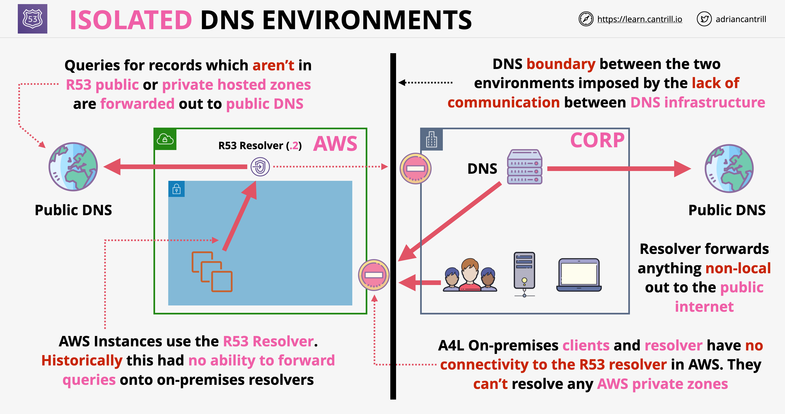
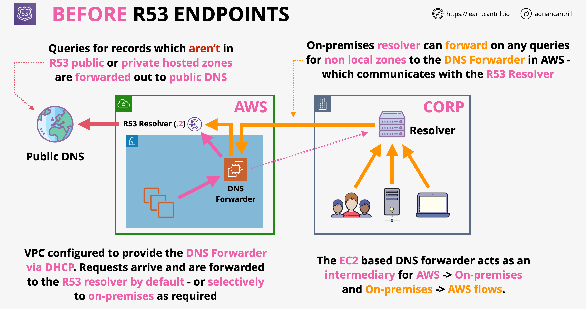
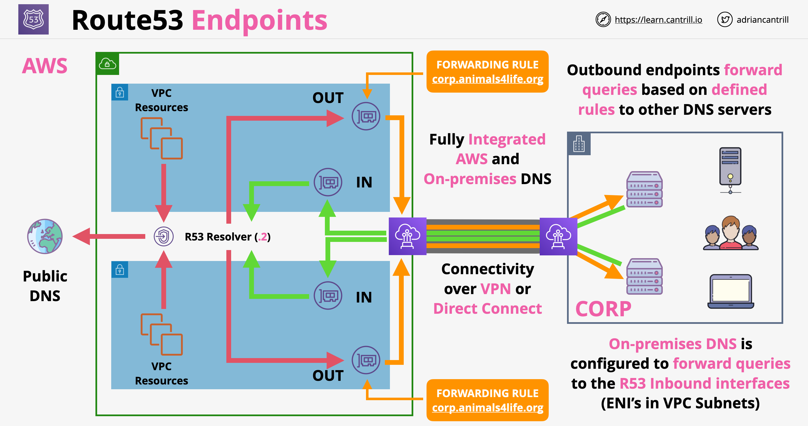
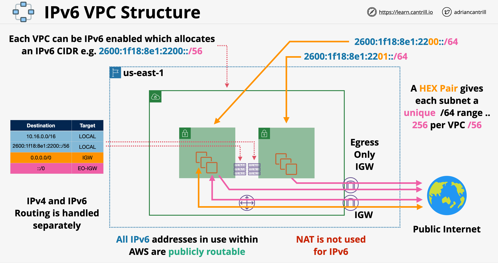

# VPC - Virtual Private Cloud

## Public vs Private Services

- Public service: a service which is accessed by using public endpoints
- Private service: a service which runs inside a VPC
- Either private or public, every service can have permissions in order to be accessible
- VPC: private network isolated from the internet. Can't communicate to the network unless we are allowing it. Nothing from the internet can reach the services from a VPC as long as we do not configure it otherwise
- Internet Gateway: we can connect it to a VPC, this will allow the services in the VPC to communicate with the public internet
- A virtual network for your account inside the AWS Cloud.
- You have a default VPC in your AWS account but you can add more VPCs.
- Resides in only one region.
- Has CIDR (Classless Inter-Domain Routing) blocks of IP addresses.
- Can have multiple subnets.

## CIDR block:
- Can have a mask from /16 to /28.
- A VPC has one primary IPv4 CIDR block.
- You can associate secondary IPv4 CIDR blocks with your VPC.
- You cannot increase or decrease the size of an existing CIDR block.
- In the same VPC, you cannot mix CIDR blocks between RFC 1918 ranges: 10.0.0.0/8, 172.16.0.0/12 and 192.168.0.0/16.

## Subnets:
- A subnet resides in only one Availability Zone.
- AWS reserves 5 IP addresses per Subnet (first 4 and last 1).
- Automatic routing between subnets inside a VPC.

##### Subnet type:
- Public subnet. 
- Private subnet.
- VPN-only subnet.

##### Public Subnet:
- Any subnet with a (default) route to an Internet Gateway (IGW).
- If you want your instance in a public subnet to communicate with the internet (through an IGW), it must have a public IP address (dynamic) or an Elastic IP address (static). 

##### Private Subnet:
- Does not have a route to an Internet Gateway.
- Instances in a private subnet can still reach internet through a NAT gateway or NAT instance. In this case the default route of the subnet is the NAT Gateway/Instance.
- The NAT Gateway/Instance sends traffic to the Internet Gateway.
- The NAT Gateway/Instance is created in the public subnet and has another interface in the private subnet.

##### VPN-only subnet:
- If a subnet doesn't have a route to the internet gateway, but has its traffic routed to a virtual private gateway for a Site-to-Site VPN connection, the subnet is known as a VPN-only subnet.

##### Sharing VPC/Subnets:
- VPC sharing allows multiple AWS accounts to create their resources into shared, centrally-managed VPCs. 
- In this model, the account that owns the VPC (owner) shares one or more subnets with other accounts (participants) that belong to the same organization from AWS Organizations.
- After a subnet is shared:
	- Participants can view, create, modify, and delete their application resources in the subnets shared with them.
	- Participants cannot view, modify, or delete resources that belong to other participants or the VPC owner. 
- You must enable resource sharing from the management account for your organization. 
- You cannot share:
	- default subnets,
	- any subnets in the default VPC.

## IP Addressing:
- An instance’s primary interface gets (manually or automatically) a MANDATORY private IPv4 address from the subnet range.
- In ADDITION to the private IP address, you can associate the following IP addresses to your interface:
	- Public IP address: Dynamic IPv4 public address.
	- Elastic IP address: Static IPv4 public address.
	- IPv6 address.

Public IP Addresses:
- Allocated dynamically from the AWS public addresses pool.
- The subnet has a modifiable attribute that determines whether instances launched into that subnet receive a public IP address. This attribute is:
	- Enabled by default in a default subnet. 
	- Disabled by default in a non-default subnet. 
- A public IP address is mapped to the primary private IP address through network address translation (NAT) by the Internet Gateway. 

Elastic IP addresses:
- Static IPv4 public address.
- Can be provided by AWS or you can bring your own public IP addresses (BYOIP).
- An Elastic IP address is a property of a network interface.
- It can be associated with a single instance or network interface at a time. 
- You're limited to five Elastic IP addresses per account. 
- An Elastic IP address is mapped to the primary private IP address through network address translation (NAT) by the Internet Gateway. 

An Elastic IP address doesn’t incur charges as long as all the following conditions are true:
	- The Elastic IP address is associated with an EC2 instance.
	- The instance associated with the Elastic IP address is running.
	- The instance has only one Elastic IP address attached to it.
	- The Elastic IP address is associated with an attached network interface, such as a Network Load Balancer or NAT gateway.

IPv6 Addressing:
- You can optionally associate an IPv6 CIDR block with your VPC, and associate IPv6 CIDR blocks with your subnets.
- The IPv6 CIDR block for your VPC is automatically assigned from Amazon's pool of IPv6 addresses; you cannot choose the range yourself. 
- Each instance will have BOTH an IPv4 and an IPv6 address. You are therefore bound to the number of available IPv4 addresses in your subnet.

## DHCP:
- When you create a VPC, AWS creates a set of DHCP options and associates them with the VPC.
- You can configure your own DHCP options set for your VPC. 
- By default, all instances in a non-default VPC receive an unresolvable host name that AWS assigns (for example, ip-10-0-0-202). 
- In the DHCP options sets you can define:
	- domain-name-servers: up to 4. Default=AmazonProvidedDNS (AWS Route 53 Resolver).
	- domain-name. Default={region}.compute.internal.
	- ntp-servers. Default=None.
	- netbios-name-servers. Up to 4. Default=None.
	- netbios-node-type. Default=None.
- After you create a set of DHCP options, you can't modify them. You need to create another set.
- You can also set up your VPC to use no DHCP options at all. 
- Dynamic Host Configuration Protocol: offers auto configuration for network resources
- Every device has a hard-coded MAC address (Layer 2 address)
- DHCP begins with a L2 broadcast to discover a DHCP server on the local network
- Once discovered a DHCP server and a DHCP clients communicate, meaning that the client will get in the end an IP address, a Subnet Mask and Default Gateway address (L3 configuration)
- DHCP also configures which DNS server should a resource use in a VPC
- Also configures NTP servers, NetBios Name Servers and Node types
- For DNS server we can explicitly provide values or we can use `AmazonProvidedDNS`
- We also get allocated 1 or 2 DNS names for the services in the VPC. One can be public if the instance has a public IP address allocated
- Custom DNS names: we can give custom DNS names to EC2 instances if we use our own custom DNS servers
- DHCP options sets:
    - Once created option sets can not be changed
    - Can be associated with 0 or more VPCs
    - Each VPC can have a max of 1 option set associated
    - We we change a DHCP option set associated to the VPC, the change is immediate, but any new setting will only affect anything once a DHCP renew occurs
    - What we can configure in an option set:
        - DNS server (Route 53 resolver) what we can use in the VPC
        - NTP server

##  DNS Services:
- DNS services are provided by the "Amazon Route 53 Resolver" on the reserved IP address at the base of the VPC IPv4 network range plus 2 (e.g. 10.0.0.2).
- Do not confuse this with the Route 53 private/public hosted zones.
- We provide your instance in a VPC with public and private DNS hostnames that correspond to the public IPv4 and private IPv4 addresses for the instance.
- We do not provide DNS hostnames for IPv6 addresses. 
- Private (internal) DNS Hostname:
	- Format:  ip-{private-ipv4-address}.{region}.compute.internal except for the us-east-1 Region.
	- Resolves to the private IPv4 address of the instance. 
	- When you launch an instance into a VPC, it always receives a private DNS hostname. 
- Public (external) DNS Hostname:
	- Format: ec2-{public-ipv4-address}.{region}.compute.amazonaws.com except for the us-east-1 Region.
	- Resolves to the public IPv4 address of the instance outside the network of the instance, and to the private IPv4 address of the instance from within the network of the instance. 
	- When you launch an instance into a VPC, it receives a public DNS hostname if it has a public IPv4 address, and if both the DNS hostnames and DNS support attributes for your VPC are set to true. 

DNS Support Attributes in the VPC:
- enableDnsSupport: Indicates whether the DNS resolution is supported.
- enableDnsHostnames: Indicates whether instances with public IP addresses get corresponding public DNS hostnames. 
- By default, both attributes are set to true in a default VPC or a VPC created by the VPC wizard. 
- By default, only the enableDnsSupport attribute is set to true in a VPC created any other way. 

DNS Private Hosted Zones:
- A service provided by AWS Route 53.
- If you want to access the resources in your VPC using custom DNS domain names, such as "example.com", instead of using private IPv4 addresses or AWS-provided private DNS hostnames, you can create a private hosted zone in Route 53. 
- A private hosted zone does not expose your resources to the Internet. Private hosted zones accept DNS queries only from a VPC DNS server.
- VPC Association:
	- When you create a private hosted zone, you must associate a VPC (from the same account) with the hosted zone.
	- After you create the hosted zone, you can associate additional VPCs with it, including VPCs in different AWS accounts. 
	- If you want to associate a VPC in Account A with a private hosted zone in Account B, you need first to create an "Association Authorization" in Account B.
	- A single VPC can be associated to multiple Hosted Zones. You can therefore associate your VPC with your hosted zone in your account and with hosted zones in other accounts.
- If you use custom DNS domain names defined in a private hosted zone in Amazon Route 53, the enableDnsHostnames and enableDnsSupport attributes must be set to True.
- Supported routing policies: simple, failover, multivalue answer, and weighted records. Refer to the "Route 53" notes for more details on these policies.
- You can associate Route 53 health checks only with failover, multivalue answer, and weighted records. 
- You cannot create NS records in a private hosted zone to delegate responsibility for a subdomain.

## Elastic Network Interface (ENI):
- A logical networking component in a VPC that represents a virtual network port.
- Can include the following attributes:
	- A primary private IPv4 address from the IPv4 address range of your VPC
	- One or more secondary private IPv4 addresses from the IPv4 address range of your VPC
	- One Elastic IP address (IPv4) per private IPv4 address
	- One public IPv4 address per private IPv4 address
	- One IPv6 address per private IPv4 address
	- One or more security groups
	- A MAC address
	- A source/destination check flag
	- A description
- You can create and configure network interfaces in your account and attach them to instances in your VPC.
- The attributes of a network interface follow it as it's attached or detached from an instance and reattached to another instance. 
- Primary ENI:
	- Each instance has a default ENI, called the primary network interface (eth0). 
	- Cannot be detached.
- Secondary ENIs:
	- An instance can have secondary ENIs,
	- Can be in the same or different subnet.
	- Must be in the same AZ.
- Max number of network interfaces determined by the instance type.
- Performance is also determined by the instance type.

## Network cards:
- Instances with multiple network cards provide higher network performance, including bandwidth capabilities above 100 Gbps and improved packet rate performance. 
- The P4d instance type can have 4 network cards. All other types can have only one network card.
- A Network Card can have multiple network interfaces (max defined by instance type).
- Each network interface is attached to one network card. 
- The primary network interface must be assigned to network card index 0. 
- Elastic Network Adapter (ENA): supports network speeds of up to 100 Gbps for supported instance types. 
- Elastic Fabric Adapter (EFA) is a network device that you can attach to your Amazon EC2 instance to accelerate High Performance Computing (HPC) .

## Enhanced Networking:
- Available on two card types: Amazon ENA (up to 100G) and Intel 82599 (Up to 10G).
- Uses SR-IOV (device pass-through) to provide high-performance networking capabilities on supported instance types. 
- Supports Jumbo Frames (useful for iSCSI performance).
- Only supported on Hardware Virtualization (HVM) and not on Paravirtualized (PV) instances.

## Global Accelerator: 
- Provides two anycast Public IP addresses that will forward your traffic to the nearest AWS POP.
- From the POP, your traffic to the resource behind these IP addresses will therefore go through the AWS backbone instead of crossing the Internet. Provides high and consistent bandwidth.
- You can enable AWS Shield (Standard or Advanced) protection on your Accelerator.
- AWS Shield Advanced will automatically detect the type of AWS resource behind the Accelerator and apply the relevant advanced DDoS protections. 

## VPC Security Groups: 
- Security Groups are stateful firewalls, meaning they detect response traffic to a request and they automatically allow traffic
- SGs do not have explicit **DENY** rules, they can be used to block bad actors (use NACLs for this)
- SGs support IP/CIDR rules and also allow to reference logical resources
- SGs are attached to Elastic Network Interfaces (ENI), when we attach a SG to an EC2, the SG will be attached to the primary ENI
- SGs are capable to reference logical resources, ex. other security groups or self referencing
- Ingress & egress, stateful firewall.
- Applied at the resource level (Instance, ELB, ...),
- Unnumbered rules (no order).
- Allow-list model: All rules are Allow rules. Anything that is not explicitly allowed is denied (micro-segmentation).
- If the source/destination is another security group, all network interfaces assigned to that referenced security group are included in the rule.
- No implicit allow between group members.
- A single interface can be member of multiple security groups.
- By default, a security group includes an outbound rule that allows all outbound traffic.
- The default security group for your VPC:
	- Your VPC automatically comes with a default security group.
	- If you don't specify a different security group when you launch the instance, we associate the default security group with your instance. 
	- Name starts with sg-….
	- Allows inbound traffic from network interfaces that are assigned to the same security group. 
	- Allows all outbound traffic.

## Network Access Control List (NACL): 
- A NACL can be considered to be a traditional firewall in an AWS VPC
- NACLs are associated with subnets, every subnet has a NACL associated to it
- Connection inside a subnet are not affected by NACLs
- NACls can be considered stateless firewalls, so we can talk about the following type of rules:
    - Inbound rules: affect data coming into the subnet
    - Outbound rules: affects data leaving from the subnet
- Source/dest and protocol filtering, Stateless.
- Applied at the subnet level,
- Rules are processed in order:
    1. A NACL determines if a the inbound or outbound rules apply
    2. It starts from the lower rule number, evaluates traffic against each rule until is a match (based on IP range, port, protocol)
    3. Traffic is allowed/denied based on the rule
- Rules can explicitly **ALLOW** and explicitly **DENY** traffic
- Rules are numbered (have an order).
- Asterisk rule:
	- Each network ACL includes a deny-all rule whose rule number is an asterisk (*).
	- The rule is the last in order.
	- Cannot be modified/removed. 
- Default Network ACL:
	- Your VPC automatically comes with a modifiable default network ACL.
	- By default, it allows all inbound and outbound IPv4 traffic and, if applicable, IPv6 traffic.
- Custom Network ACL:
	- You can create a custom network ACL and associate it with a subnet. 
	- By default, (because of the unremovable asterisk rule) each custom network ACL denies all inbound and outbound traffic until you add rules.
- Each subnet in your VPC must be associated with a network ACL. If you don't explicitly associate a subnet with a network ACL, the subnet is automatically associated with the default network ACL.
- You can associate a network ACL with multiple subnets. However, a subnet can be associated with only one network ACL at a time. 

## Route table:
- Lives inside a VPC. 
- A VPC has a default route table (Main route table) but you can add other route tables (Custom tables).
- Three types of Route Tables:
	- Subnet route table: associated to one or more subnets.
	- Gateway route table: associated with an internet gateway or virtual private gateway. 
	- Local Gateway route table: a route table that's associated with an Outposts local gateway.
- Subnet route table:
	- A Subnet has only one route table attached.
	- Any subnet that is not explicitly associated to a route table is implicitly associated to the Main route table.
	- The "Main Route Table" designation can be changed to another table. In that case, the implicit associations follow the change.
- Gateway route table: 
	- Used to send ingress traffic to an appliance for inspection.
	- You can only specify "local", a Gateway Load Balancer endpoint, or a network interface as a target. 
- The most specific route wins.
- Destinations:
	- Default route: Destination="0.0.0.0/0" or "::/0".
	- Destination can be a prefix list (pl-…….). See below.
- Targets:
	- Local (local).
	- NAT/Instance Gateway (nat-gateway-…).
	- Internet Gateway (igw-….).
	- Egress-only Internet Gateway (eigw-….).
	- Local Gateway for Outposts (lgw-….).
	- Transit Gateway (tgw-….).
	- Virtual Private Gateway (vgw-….).
	- Peering Connextion (pcx-…..).
	- VPC Endpoint (vpce-…..).
	- Network Interface (eni-….)
- Local route:
	- Target="Local".
	- Added by default for the VPC CIDR range.
	- Cannot be changed/removed.
	- You cannot add more specific routes than the local route.

## Prefix lists:
- A prefix list is a set of one or more CIDR blocks. 
- There are two types of prefix lists: AWS-managed and Customer-managed.
- AWS-managed prefix list:
	- Represents the IP address ranges for an AWS service like S3 for example.
	- The address ranges are maintained by AWS.
	- You can reference an AWS-managed prefix list in your VPC security group rules and in subnet route table entries.
	- You cannot create, modify, share, or delete an AWS-managed prefix list.
- Customer-managed prefix list:
	- A set of IPv4 or IPv6 CIDR blocks. You define and manage this list.
	- You can reference the prefix list in your VPC security group rules, subnet route table entries, and transit gateway route table entries. 
	- You can share your prefix list with other AWS accounts, enabling those accounts to reference the prefix list in their own resources.
	- Can be used only in the same region.
- When you create a prefix list, you must specify the maximum number of entries that the prefix list can support. Cannot be modified.
- When you reference a prefix list in a resource, the maximum number of entries for the prefix lists counts as the consumed number of rules or entries for the resource. 

## Internet Gateway (IGW):
- A resource to enable a VPC to connect to internet.
- Attached to a VPC. You can only have one IGW per VPC.
- Performs NAT for public IP addresses that are associated to EC2 instances.
- Works for both IPv4 and IPv6.

## Egress-only Internet Gateway (EIGW):
- Stateful egress-only IPv6-only gateway.
- Allows outbound communication over IPv6 from instances in your VPC to the internet, and prevents the internet from initiating an IPv6 connection with your instances. 
- To enable outbound-only internet communication over IPv4, use a NAT gateway or NAT instance instead. 

Internet egress traffic from private instances:
- For IPv4: You can use either a NAT instance or NAT Gateway.
- For IPv6: You need to use an Egress-only Internet Gateway because IPv6 addresses are public by default.

## NAT Gateway: 
- A service managed by Amazon, 
- Each NAT gateway is created in a specific Availability Zone and implemented with redundancy in that zone. 
- Automatic failover, 
- A NAT gateway supports 5 Gbps of bandwidth and automatically scales up to 45 Gbps.  
- Features NOT supported on NAT Gateway: Port Forwarding, Bastion Host, Traffic Metrics, Security Groups.
- You create a NAT gateway in a public subnet and it automatically gets a private IP address from your subnet range.
- You can associate exactly one Elastic IP address with a NAT gateway. Cannot be disassociated after it's created. 
- A NAT gateway supports the following protocols: TCP, UDP, and ICMP.
- You cannot associate a security group with a NAT gateway. 
- Cannot be used by resources through a VPC peering or a S2S VPN connection.
- You can have multiple NAT Gateways per VPC. Separate per Subnet.
- Cannot filter traffic based on DNS names or URLs.

## NAT Instance: 
- An EC2 instance with a NAT software (e.g. Squid Proxy). 
- You create and manage the instance and NAT software.
- You need to disable Source/Destination check on the network interface.
- Subnet failover to another NAT instance is supported. you need to use scripts to manage failover, 
- throughput depends on size of instance. 
- Can become a bottleneck.
- Scale Up: increase size or boost throughput using enhanced networking (SRIOV, …).
- Scale Out: split the workloads on different subnets with a NAT instance for each of these subnets.
- Supports manual port forwarding, bastion server, CloudWatch alarms.
- Supports Public IP addresses and Elastic IP Addresses. Can be changed.
- Private IP manually assigned.
- You can use a proxy software like Squid (open-source) to filter the traffic based on DNS names.

## AWS Transit Gateway

- It is a network transit hub which connects VPCs to each other and to on-premise networks using Site-to-Site VPNs and Direct Connects
- It is designed to reduce the network architecture complexity in AWS
- It is a network gateway object, it is HA and scalable
- Attachments: we create attachments in order for the TGW to connect to VPCs and on-premise networks. Valid attachments are:
    - VPC attachments
    - Site-to-Site VPN attachments
    - Direct Connect Gateway attachments
- Attachments are configured in each subnet of the connected VPCs
- We can also peer transit gateways across cross regions and/or cross accounts
- We can also attach transit gateways to the DX connections
- Transit Gateway Considerations:
    - Supports transitive routing: single transit gateway with multiple attachments using route tables
    - Can be used to create global networks with peering
    - We can share transit gateways using AWS RAM
    - Transit Gateways offer less complex architectures compared to VPC peering solutions

## Advanced VPC Routing

- **Subnets are associated with 1 route table (RT) only, no more noe less!**
- This route tables is either the main route table from the VPC or a custom route table
- In case of a custom route table association with a subnet, the main route table is disassociated. In case the custom RT is removed, the main RT is associated again with the subnet
- RT can associated with an internet gateway (IGW) or virtual private gateway (VGW)
- IPv4/6 are handled separately within a RT
- Routes send traffic based on a destination to a target
- Route tables have a maximum of 50 static routes and 100 dynamic routes
- When a traffic arrives to an interface (IGW, VGW), it is matched to the relevant route table
- All routes from a route table are evaluated - highest-priority matching is used
- Route tables can contain 2 types of routes:
    - Static routes: added manually by us
    - Propagated routes: added when enabled by us on the VPC or on any individual RT
- Evaluation rule for the routes: 
    1. Longest prefix wins, example /32 wins over /24, /16 or /0. More specific routes always win!
    2. Static routes take priority over propagated routes
    3. For any routes learned by propagation:
        1. DX
        2. VPN Static
        3. VPN BGP
        4. AS_PATH (distance within two logical systems)

## Ingress Routing

- All outgoing traffic is routed to a security appliances
- The security appliance is sitting in the public subnet which has a RT assigned to it. This RT sends all unmatched traffic out through the IGW and anything for the corporate network through the VGW
- Ingress routing allows to assign route tables to gateways (Gateway route tables). **Gateway route tables** can be attached to internet gateways or virtual gateways and can be used to take action on inbound traffic (route to a security instance for assessment)

## Accelerated Site-to-Site VPN

- Performance enhancement for AWS Site-to-Site VPN that uses the AWS global network, the same network used for Global Accelerator and CloudFront
- Using a classic Site-to-Site VPN, the traffic goes through the public internet. In order to avoid this, some companies use a Site-to-Site VPN over Direct Connect. Direct Connect offers more better performance, but at a higher cost. Since DX is not an option for everybody, accelerated Site-to-Site VPN was created to improve performance compared to classic Site-to-Site VPNs
- Accelerated Site-to-Site VPN architecture:

- Acceleration can be enabled when creating a Transit Gateway attachment only! Not compatible with VPNs using virtual gateways (VGW)
- Accelerated Site-to-Site VPN has a fixed accelerator cost fee and a transfer fee

## VPC Endpoint (VPCE): 
- Enables you to access an AWS service (like S3) or a VPC Endpoint Service directly from your VPC without going out through the Internet and an Internet Gateway.
- Lives inside a VPC,
- VPC endpoints are virtual devices. They are horizontally scaled, redundant, and highly available VPC components.
- Instances in your VPC do not require public IP addresses to communicate with resources in the service. 
- Supported within the same Region only.
- A VPC endpoint policy is an IAM resource policy that you attach to an endpoint.

AWS PrivateLink:
- A technology that enables you to privately access services by using private IP addresses. 
- A "VPC Endpoint Service" is a service hosted by another AWS customer or Partner in their own VPC.
- You can create your "VPC Endpoint Service" for your own application in your VPC:
	- You configure it as an AWS PrivateLink-powered service (referred to as an endpoint service).
	- Other AWS principals can create a connection from their VPC to your endpoint service using an interface VPC endpoint or a Gateway Load Balancer endpoint.
	- You are the service provider. The AWS principals that create connections to your service are service consumers. 

## VPC Endpoint Types:
- Interface endpoint: 
	- an elastic network interface.
	- Powered by AWS PrivateLink. 
	- It serves as an entry point for traffic destined to a supported AWS service or a "VPC Endpoint Service" or an AWS Marketplace service.
	- has a private IP address from the IP address range of your subnet.
	- Can be associated with multiple subnets in different AZs (1 subnet per AZ).
	- Supports TCP only.
	- you can attach an endpoint policy to it in order to control access to the service to which you are connecting. 
	- Charge per interface.
	- Can be extended to S2S VPN and Direct Connect.
	- Supported within the same Region only.
	- Supports Security Groups.
	- When you create an interface endpoint, we generate endpoint-specific DNS hostnames that you can use to communicate with the service. For example, vpce-0fe5b17a0707d6abc.ec2.us-east-1.vpce.amazonaws.com.
	- You make requests to the service using the endpoint DNS name.
	- Private DNS option: if enabled (default), associates a private hosted zone with your VPC, allowing you to use the normal AWS service DNS name (for example, ec2.us-east-1.amazonaws.com) instead of the endpoint-specific DNS name. 

- Gateway endpoint:
	- Introduced by AWS before the PrivateLink technology.
	- Only two supported AWS services: Amazon S3 and DynamoDB.
	- Route tables control the routing of traffic between your VPC and the target service. 
	- You specify a gateway endpoint in your route table as a target for traffic destined to the service: Destination=pl-xxxxx and Target=vpce-xxxxxx.
	- Each subnet that's associated with one of these route tables has access to the endpoint, and traffic from instances in these subnets to the target service is then routed through the endpoint. 
	- You can create multiple endpoints in a single VPC, for example, to multiple services. 
	- You can create multiple endpoints for a single service, and use different route tables to enforce different access policies from different subnets to the same service. 
	- Cannot be extended out of a VPC: resources on the other side of a VPN connection, VPC peering connection, transit gateway or AWS Direct Connect connection.
	- Supported within the same Region only.

- Gateway Load Balancer endpoint:
	- This type of endpoint serves as an entry point to intercept traffic and route it to a service that you've configured using Gateway Load Balancers, for example, for security inspection.
	- Gateway Load Balancers enable you to deploy, scale, and manage virtual appliances, such as firewalls, intrusion detection and prevention systems, and deep packet inspection systems.
	- has a private IP address from the IP address range of your subnet.
	- Powered by AWS PrivateLink. 
	- tied to one subnet.
	- only one can be created in an AZ for any given service.
	- Supports up to 40 Gbps,
	- Does not support security groups nor endpoint policies.
	- Supported within the same Region only.

## VPC Gateway Endpoint Policies:
- A sort of resource policy on the endpoint itself.
- Does not provide permissions on the target resources, but rather limits the use of the endpoint itself.
- For S3:
	- You still need to provide IAM permissions on the target S3 buckets.
	- You can optionally restrict access to the target buckets only via a specified VPC endpoint using the condition key: "aws:sourceVpce" (stringEquals or stringNotEquals) in the bucket policy.
	- You cannot refer to the source IP addresses in the S3 bucket policy.

## VPC Peering:
- Enables direct VPC to VPC communications without going out to Internet.
- Not transitive.
- Same or different AWS accounts. Same or different Regions.
- Inter-Region VPC Peering is encrypted.
- Supports IPv4 & IPv6.
- No IP overlapping supported.
- Max active VPC peerings per VPC: Default=50, By request=125.
- DNS name resolution is supported: after enabling this option, if instances on either side of the VPC peering connection address each other using a public DNS hostname, the hostname resolves to the private IP address of the instance. 
- You need to Use route tables to configure routing.
- You need to Update inbound & outbound rules for your security groups.
- You cannot use remote gateways (gateways in a peered VPC) through a VPC peering: IGW, VGW, DCX, VPCE.
- Process to create a Peering:
	- you create a VPC peering connection on VPC1,
	- then you go to VPC2 and you find the connection request that you need to accept.
	- you go the route tables of VPC1 and VPC2, you create a route with next-hop is the peering connection ID (starts with pcx-….)

## VPC Access options:
- AWS Site-to-Site VPN: connects to a hardware-based VPN. 
- Software Site-to-Site VPN: you use your own VPN software on AWS EC2 (e.g. Cisco, Fortinet, …).
- Client VPN: connects your users to AWS or on-premises resources using a VPN software client.
- Direct Connect: private connection from your premises to AWS.

## AWS Site-to-Site VPN:
- A Site-to-Site VPN is a logical connections between a VPC and an on-premise network running over the public internet. The connection is encrypted using IPSec
- Can be fully HA if it is implemented correctly
- It is quick to provision, it can be provisioned in less than an hour (contrast to DX)
- Components involved in creating a VPN connection:
    - **VPC**
    - **Virtual Private Gateway (VGW)**: it is a gateway object which can be the target of one or more rules in a Route Tables. It can be associated to a single VPC
    - **Customer Gateway (CGW)**: can refer to 2 different things:
        - Often is referred to the logical configuration in AWS
        - Physical on-premises router which the VPN connects to
    - **VPN Connection** itself: the connection linking the VGW from the AWS to the CGW
- Static vs Dynamic VPN:
    - **Dynamic VPN** uses BGP protocol, if customer router does not support BGP, we can not use dynamic VPNs
    - **Static VPN** uses static network configuration: static routes are added to the route tables AWS side, static networks has to be identified on the VPN connection on-premise side. It is simple, it just uses IPSec, works anywhere, having limitation on terms of HA
    - Dynamic VPN uses BGP: allows routing on the fly, allows multiple links to be used at once between the same locations. Allows using HA available architectures.
        - Route propagation: if enabled means that routes are added ro the Route Table automatically
- Considerations for VPN:
    - Speed Limitation for VPN: *1.25 Gbps*, AWS limitation
    - Latency considerations: inconsistent, traffic goes through the public internet
    - Cost: hourly cost for outgoing traffic
    - VPN can be used for Direct Connect backup or they can be used over the Direct Connect for adding a layer of encryption

## VPC Flow Logs:
- A feature that enables you to capture information about the IP traffic going to and from network interfaces in your VPC.
- Flow log data can be published to Amazon CloudWatch Logs or Amazon S3.
- Flow log data is collected outside of the path of your network traffic, and therefore does not affect network throughput or latency.
- You can create a flow log for a VPC, a subnet, or a network interface. 
- You can create flow logs for network interfaces that are created by other AWS services, such as: ELB, RDS, ElastiCache, Redshift, NAT Gateway, Transit Gateway.
- You can specify the type of traffic to capture (accepted traffic, rejected traffic, or all traffic).
- You can optionally specify a custom format for the flow log record.
- Default aggregation interval: 10mn.
- A Flow log cannot be modified.
- Some traffic like DHCP is not logged.
- If your network interface has multiple IPv4 addresses and traffic is sent to a secondary private IPv4 address, the flow log displays the primary private IPv4 address in the dstaddr field. To capture the original destination IP address, create a flow log with the pkt-dstaddr field.
- Example of use case: Flow Logs sends logs to CloudWatch Logs which generates metrics that trigger CloudWatch alarms which call actions (SNS, Lambda, …).

## Traffic Mirroring:
- A VPC feature that you can use to copy network traffic from an elastic network interface of Amazon EC2 instances.
- You can then send the traffic to out-of-band security and monitoring appliances
- You can filter the traffic to be mirrored.
- Any traffic that matches the filter rules is encapsulated in a VXLAN header. It is then sent to the target on UDP port 4789.
- The target can be in another AWS account.
- The target can be either a Network interface or a Network Load Balancer.

### VPC Endpoints Policies

- Endpoints policies don't grant access to any AWS services in isolation
- Identities accessing resources still need they permissions to access resources
- An endpoint policy only limits access if the service is accessed to the specific endpoint
- The endpoint policy contains a policy and conditions (who has access to what)
- Policies are commonly used to limit what private VPCs can access

### Advanced VPC DNS and DNS Endpoints

- In every VPC the VPC.2 IP address is reserved for the DNS
- In every subnet the .2 is reserved for Route53 resolver
- Via this address VPC resources can access R53 Public and associated private hosted zones
- Route53 resolver is only accessible from the VPC, hybrid network integration is problematic both inbound and outbound

- Solution to the problem before Route53 endpoints were introduced:

- Route53 endpoints:
    - Are deliver as VPC interfaces (ENIs) which can be accessed over VPN or DX
    - 2 different type of endpoints:
        - Inbound: on-premises can forward request to the R53 resolver
        - Outbound: interfaces in multiple subnets used to contact on-premises DNS
        - Rules control what requests are forwarded
        - Outbound endpoints have IP addresses assigned which can be whitelisted on-prem
- Route53 endpoint architecture:

## IPv6 Capability in VPCs

- IPv6 addresses are all publicly routable
- NAT is not used for IPv6, IPv6 does not need network address translation simply because of the huge number of available IPv6 addresses
- IPv6 needs to be manually enabled on a VPC. We can either bring our own IP address in a VPC or utilize an AWS provided range
- In case of AWS provided IPv6 addresses, AWS will allocate an uniq /56 range to the VPC. This range will be entirely uniq and all addresses will be publicly routable
- If we chose to allocate an IP range for a VPC, AWS will use a hex pair to uniquely allocate IP addresses to the subnets
- Routing is handled separately for the IPv6 addresses, we will have IPv4 routes and IPv6 routes
- Egress only internet gateway: similar to NAT gateway, allows outbound traffic denying inbound traffic in case of IPv6 addressing. NAT gateways or instances do not support IPv6!
- We can have both internet gateway and egress only interne t gateway associated to the same subnet

- IPv6 can be set up while creating a VPC/subnet or we can migrate an existing VPC to IPv6
- We can enable IPv6 on specific subnets only
- We can point IPv6 traffic to internet gateway and egress only internet gateways as well
- Not every service in AWS supports IPv6!

## Advanced VPC Structure - Subnets and Tiers

- Public subnets can be configured to not give public IP addresses to all instances by default. We can explicitly allocate public IP addresses to some resources
- If no public IP is addressed to a resource in a public subnet, it wont be accessible from the outside
- Security groups: we can restrict inbound traffic by allowing traffic from only selected instances
- How many subnets does an app need:
    - We don't need public and private subnets for addressing and security. This can be configured within one subnet. Exception to this: filter traffic using a NACL
    - We need different subnets for different routing
    - Internet-facing load balancers can communicates with private instances. Internet facing load balancer needs to run in a public subnet
    - Number of subnets needed: number of subnets needed for the APP * AZs
