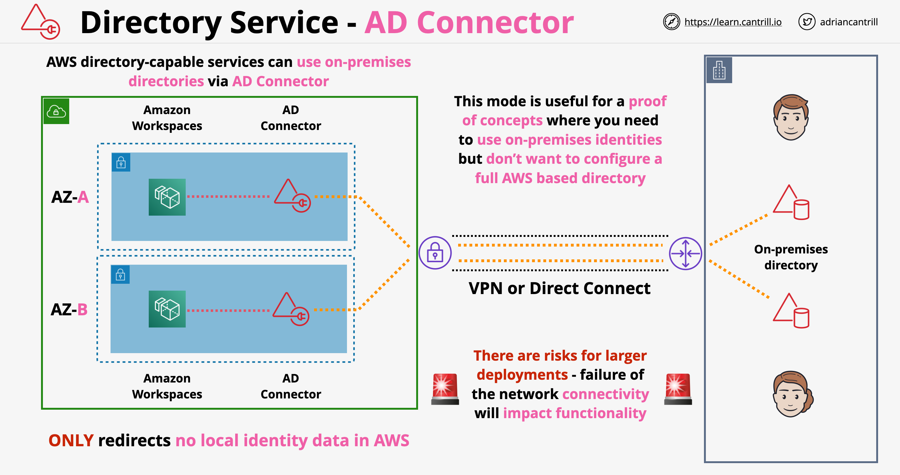

# AWS Directory Service:
- provides multiple ways to use Microsoft Active Directory (AD) with other AWS services. 
- Four options:
	- AWS Directory Service for Microsoft Active Directory (Managed AD).
	- AD Connector.
	- Simple AD.
	- Amazon Cognito.

## AWS Directory Service for Microsoft Active Directory:
- Also known as AWS Managed Microsoft AD.
- Powered by an actual Microsoft Windows Server Active Directory (AD), managed by AWS in the AWS Cloud.
- Supports federation.
- AWS provides monitoring, daily snapshots, and recovery as part of the service.
- Standard Edition: Up to 5,000 employees and 30,000 objects.
- Enterprise Edition: Up to 500,000 objects.

## AD Connector:


- AD Connector provides a pair of directory endpoints in a VPC
- It injects ENIs into to subnets in a VPC
- Once injected AD connector appears as a native directory to other AWS instances capable of using a directory service
- Redirects requests to an existing on-premise directory server, which means no directory data is stored in AWS
- AD connector allows us to use AWS services which do require an AD directory (such as Workspaces) and use this with an on-premises directory service => we don't need to deploy additional AD directory in AWS
- There are 2 sizes of directory services *small* and *large*, while there are no explicit user limits, the chosen size does impact the amount of compute allocated by AWS for the connector
- We can use multiple connector to distribute the load
- AD directory is placed in 2 subnets in a VPCs in different availability zones => resilient to AZ failure
- The connector should be configured to point to at least one on-premise directory service => we need to provide account information for the connector to be able to authenticate itself
- Requires a working network to on-premise service, otherwise wont work (private network via Direct Connect or VPN)

- A proxy service to establish a trusted relationship between your Active Directory and AWS. 
- AD Connector doesn’t rely on complex directory synchronization technologies or Active Directory Federation Services (AD FS).
- Uses cases:
	- Sign in to AWS applications such as Amazon WorkSpaces, Amazon WorkDocs, and Amazon WorkMail by using your Active Directory credentials.
	- You can also join your EC2 Windows instances to your on-premises Active Directory domain through AD Connector using seamless domain join. 
	- Provide federated sign-in to the AWS Management Console: authorized Active Directory identities assume AWS IAM roles and get temporary (1hr) AWS credentials from STS.
- An IAM role can be mapped either to an AD User or to an AD Group.
- When an AD User is mapped to multiple IAM roles, he gets a selection page when signing-in on the AWS Management Console to choose the role he wants to use.
- AD Connector is not compatible with RDS SQL Server. 
- A dual Availability Zone proxy service.
- Comes in two sizes, small and large.
- Can add MFA.

### AD Connector Architecture



### Use cases for AD Connector

- Prof of concept projects, we don't want to move our Active Directory to AWS for it
- We have a small infrastructure in AWS and we don't want to move the Active Directory to AWS
- Legal/compliance reasons - we don't want to store user info in AWS
- For larger requirements use AWS Directory Service

## Simple AD:
- A Microsoft Active Directory–compatible directory from AWS Directory Service that is powered by Samba 4.
- Supports basic Active Directory features such as user accounts, group memberships, joining a Linux domain or Windows based EC2 instances, Kerberos-based SSO, and group policies.

## Amazon Cloud Directory:
- A highly available multi-tenant directory-based store in AWS. 
- Can scale automatically to hundreds of millions of objects as needed for applications. 
- You can organize directory objects into multiple hierarchies to support many organizational pivots and relationships across directory information.
- Examples:
	- A directory of users may provide a hierarchical view based on reporting structure, location, and project affiliation. 
	- A directory of devices may have multiple hierarchical views based on its manufacturer, current owner, and physical location. 


# Comparison of Identity Solutions:
```
OIDC  |
      |==============> IAM Federation =============> AWS IAM Authorization (Console or API Token from STS).
SAML  |
```
```
SSO Directory     |                      |=========> AWS IAM Authorization (Console or Token download).
Active Directory  |=====> AWS SSO ======>|=========> SAML for built-in SaaS applications.
SAML              |                      |=========> SAML for custom application.
```
```
Cognito User Pools Directory |
Social IdP                   |                            |==> JSON web tokens (JWT)
OIDC                         |===> Cognito User Pools ===>|
SAML                         |                            |==> AWS IAM Authorization (API Token from STS)
```
```
Cognito User Pools |
Social IdP         |                                
OIDC               |===> Cognito Identity Pools =====> AWS IAM Authorization (API Token from STS)
SAML               |                                
```
