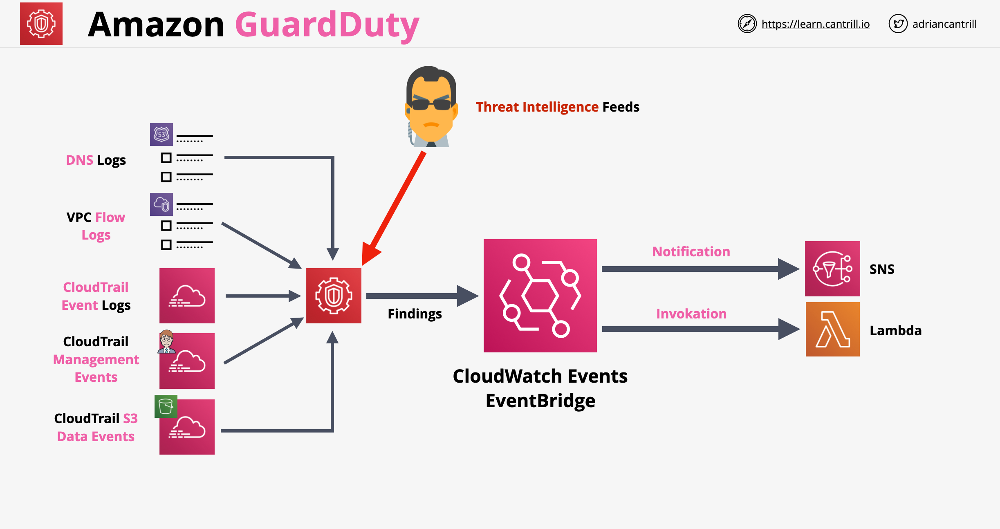

# Amazon GuardDuty
- A continuous security monitoring service that analyzes and processes the following Data sources: 
	- VPC Flow Logs, 
	- CloudTrain Event Logs.
	- CloudTrail management Events,
	- CloudTrail S3 Data Event,
	- DNS logs. 
- Uses threat intelligence feeds, such as lists of malicious IP addresses and domains, and machine learning to identify unexpected and potentially unauthorized and malicious activity within your AWS environment. 
- This can include issues like escalations of privileges, uses of exposed credentials, or communication with malicious IP addresses, or domains. 
- For example, GuardDuty can detect compromised EC2 instances serving malware or mining bitcoin. 
- Also monitors AWS account access behavior for signs of compromise, such as unauthorized infrastructure deployments, like instances deployed in a Region that has never been used, or unusual API calls, like a password policy change to reduce password strength. 
- Can trigger remediation actions.
- Supports a Trusted IP list and multiple Threat lists (lists of known malicious IPs).
- Supports multiple accounts (Master and Member accounts)
- GuardDuty architecture:
    
