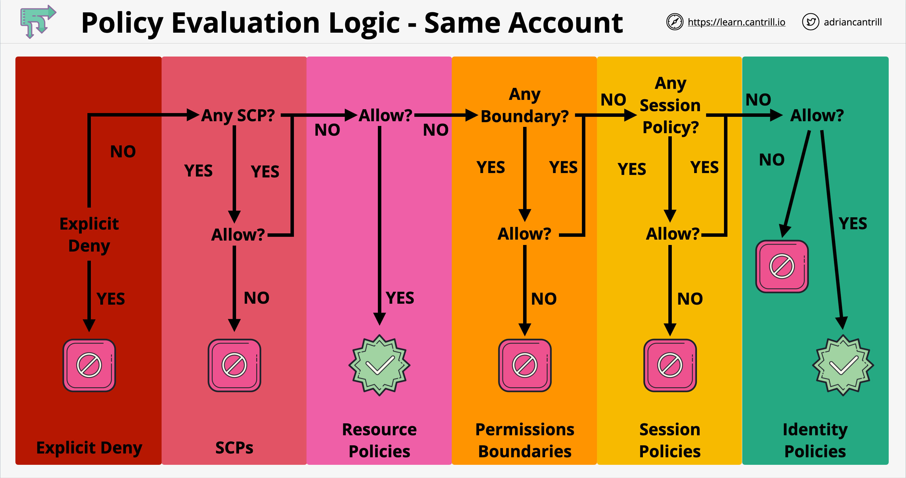
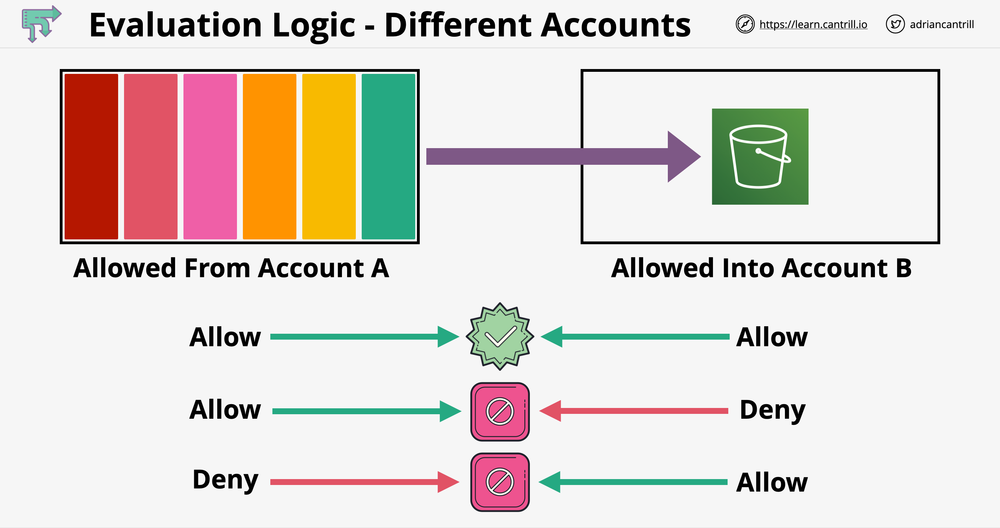

AWS Identity and Access Management (IAM):
- IAM is a free service.
- Supports MFA
- Can also provide access to AWS resources for applications running on EC2.
- Supports federation with external identity providers.
- PCI DSS compliant.
- IAM Resources (objects): user, group, role, policy, identity provider.
- IAM identity: user, group or role.
- IAM Principal: a person or application that is authenticated using an IAM identity in order to make a request for an action or operation on an AWS resource.

Root User:
- When you first create an AWS account, you begin with a single sign-in identity that has complete access to all AWS services and resources in the account.
- This identity is called the AWS account root user. 
- Only one root user per account.
- The root user is identified by an email address.
- Logs in to the AWS management console from a global generic portal.
- The root user can create users and groups in IAM.

IAM Users:
- A user in AWS consists of a name and credentials.
- A user logs in the AWS Management Console from an account-specific portal.
- A user that represents an application is called a Service Account.

IAM Credentials:
- Console password: for AWS Management Console.
- Access Keys: 
	- A combination of an access key ID and a secret access key. 
	- You can assign two to a user at a time.
	- Can be used in API calls, CLI and PowerShell.
	- Enabling MFA has no effect on Access Keys.
- SSH Keys: for AWS CodeCommit only.
- Server certificates: for some AWS services.

IAM Groups:
- You can add a user to a maximum of 10 groups.
- Groups cannot be nested.
- A group cannot be identified as a Principal in a resource-based policy. 

# IAM Roles:
- An IAM identity that you can create in your account that has specific permissions. 
- Has some similarities to an IAM user. Roles and users are both AWS identities with permissions policies that determine what the identity can and cannot do in AWS. 
- However, instead of being uniquely associated with one person, a role is intended to be assumable by anyone who needs it.
- When you assume a role, the AWS Security Token Service (STS) provides you with temporary security credentials for your role session. 
- Assuming a role = getting temporary keys to perform the actions allowed for that role.
- While a user is assuming a role, he looses access to his original user permissions.

# AWS Service Roles:
- A service role: A role that a service assumes to perform actions in your account on your behalf. 

# AWS Service-Linked Role:
- A service-linked role is a unique type of IAM role that is linked directly to an AWS service (linked service). 
- Service-linked roles are predefined by the linked service and include all the permissions that the linked service requires to call other AWS services on your behalf.
- Can be created in 3 ways:
	- An AWS service automatically creates the role (e.g. Auto Scaling: used to manage EC2 instances).
	- You create the role as part of a wizard or process in the AWS service.
	- The service might require that you use IAM to create or delete the role. 
- The user who creates the linked service needs to have the permission to create Service-linked roles.
- The permissions granted by a service-linked role are indirectly transferable to other users: after the service-linked role is created, all users that have access to the linked AWS service will get indirect access to the services referred in the role permissions.
- Cannot be deleted until all resources created by that role have been deleted.

# EC2 Instance Profile:
- An IAM role that you can attach to an EC2 instance.
- The AWS SDKs, AWS CLI, and Tools for Windows PowerShell automatically get the temporary credentials from the EC2 instance metadata service and use them. 
- Applications running on that instance can retrieve temporary security credentials from STS (AssumeRole call) and perform actions that the role allows.
- An instance can assume only one IAM role at a time.
- Replacing the role of an instance has immediate effect.

# IAM Permissions:
- let you specify access to AWS resources.
- are the building blocs of policies.
- To grant permissions to IAM entities (users and roles) you put the permissions in a policy and then attach the policy to the entity.
- Permissions decision tree:
	- Firstly looks for explicit denies,
	- Secondly looks for explicit allows,
	- Lastly denies any action that is not explicitly allowed.

# Policy Statement elements:
- Sid (statement ID) is an optional identifier that you provide for the policy statement. 
- Effect:
	- Allow or Deny.
	- If a policy contains both an Allow effect and a Deny effect on the same action, the Deny effect takes precedence.
- Principal: 
	- needed for resource-based policies to indicate the account, user, role, or federated user to which you would like to allow or deny access.
	- Can be a user. Syntax: "Principal": { "AWS": "arn:aws:iam::AWS-account-ID:user/user-name" }
	- Can be a whole account. Syntax: "Principal": { "AWS": "arn:aws:iam::123456789012:root" } or "Principal": { "AWS": "123456789012" }.
	- Federated Web identiy user: "Principal": { "Federated": "graph.facebook.com" }.
	- Federated SAML users: "Principal": { "Federated": "arn:aws:iam::AWS-account-ID:saml-provider/provider-name" }.
- NotPrincipal: Matches every principal except those specified.
- Action: list of actions that the policy allows or denies. 
- NotAction:
	- Matches every action except those specified. 
	- use the NotAction element in a statement with "Effect": "Allow" to provide access to all of the actions in an AWS service, except for the actions specified in NotAction. 
	- use the NotAction element in a statement with "Effect": "Deny" to deny access to all of the listed resources except for the actions specified in the NotAction element. 
	- The NotAction/Deny combination does not allow the listed items, but instead explicitly denies the actions not listed. You must still allow actions that you want to allow. 
- Resource: list of resources to which the actions apply. 
- NotResource: matches every resource except those specified. 
- Condition: the circumstances under which the policy applies. 


# IAM Policies:
- AWS supports six types of policies: identity-based policies, resource-based policies, permissions boundaries, Organizations SCPs, ACLs, and session policies. 
- Identity-based policies:
	- permissions policies that you attach to an IAM identity, such as an IAM user, group, or role. 
	- control what actions the identity can perform, on which resources, and under what conditions.
	- Two types of identity based policies: inline and managed.
- Resource-based policies:
	- permissions policies that you attach to a resource such as an Amazon S3 bucket or an IAM role trust policy. 
	- control what actions a specified principal can perform on that resource and under what conditions.
	- Can be used to grant cross-account access to your resources. Refer to the "Cross-Account Access" section below. 
- The IAM service itself (for IAM objects) supports only one type of resource-based policy called a role trust policy, which is attached to an IAM role and defines which principal entities (accounts, users, roles, and federated users) can assume the role.
- Because an IAM role is both an identity and a resource, you must attach both a trust policy (who can assume the role) and an identity-based policy (what the role can do) to an IAM role. 

# Inline Policies:
- An inline policy is a policy that's embedded in an IAM identity (a user, group, or role). Can be created/modified at any time.
- An IAM identity can have multiple inline policies.
- Main use case for inline polices: you want to be sure that the permissions in a policy are not inadvertently assigned to an identity other than the one they're intended for.

# Managed Policies:
- Customer-Managed Policies:
	- You can create standalone policies that you administer in your own AWS account, which we refer to as customer managed policies. 
	- Have automatic versioning. IAM stores up to five versions of your customer managed policies. 
- AWS-Managed Policies:
	- are designed to provide permissions for many common use cases.
- Job Functions:
	- A particularly useful category of AWS-managed policies that are designed for job functions like Systems Administrator or Network Administrator. 
	- Align closely to commonly used job functions in the IT industry. 
	- One key advantage is that they are maintained and updated by AWS as new services and API operations are introduced. 
- The maximum number of managed policies that you can attach to a user or a group is 10. The consolidated maximum is therefore 110 managed policies per user: 10 + 10x10 (10 policies per user + 10 groups per user x 10 policies per group).

# Permission Boundaries:
- A permissions boundary is an advanced feature used to set the maximum permissions that an identity-based policy can grant to an IAM entity.
- You can use an AWS-managed policy or a customer-managed policy to set the boundary for an IAM entity (user or role): this policy will limit the maximum permissions for the user or role. 
- When the permission boundary is attached to a user/role:
	- He cannot change or remove it from himself or from other users.
	- He cannot create IAM principals without this permissions boundary. This prevents privilege escalation.
- The permission boundary does not provide permissions on its own.
- Identity-based policies (inline or managed) grant permission to the entity, and permissions boundaries limit those permissions. The effective permissions are the intersection of both policy types. 
- Resource-based policies are not limited by permission boundaries.

# Cross-Account Access:
- Use case: when you want to allow a user in a trusted account to access a resource in a trusting account.
- Roles are the primary way to grant cross-account access. However, some AWS services allow you to use a resource-based policy directly on the target resource (instead of using a role as a proxy). 
- To allow a cross-account access, you need to allow this access in the trusting account AND in the trusted account. Details below:
- Using roles for Cross-account access:
	- You need to create a role in the trusting account that has the required permissions on the target resource.
	- In order to allow a user in the trusted account to assume this role in the trusting account:
		- In the trusting account: the trusted user or the whole trusted account is granted the permission to assume this role (trust policy).
		- In the trusted account: a policy must allow your user to assume that role in the trusting account.
	- You can optionally use an ExternalID string in the trust policy to avoid the confused deputy problem (see below).
- Using Resource-based policies for Cross-account access:
	- Supported on many AWS services like S3, SNS and SQS.
	- You define a resource-based policy in the target resource in the trusting account: used only to set a maximum limit of the access you grant to the trusted account.
	- You add the permissions also in the trusted account for the user to perform the actions on the target resource.

# The Confused Deputy Problem:
- Scenario: 
	- You contracted another account (deputy) to access your account and perform some service.
	- The deputy is contracted by many other AWS customers.
	- You create a role that can be assumed by the deputy to provide him access to your resources.
	- You provide the role ARN to the deputy so that he can assume it when needed.
- Problem:
	- A 3rd party account contracts your deputy for his services.
	- The 3rd party guesses your role ARN and provides it to the deputy as if it was their role ARN.
	- The 3rd party instructs the deputy to act on their account.
	- Since they have confused the deputy, he will act on your account instead.
- Solution:
	- The deputy generates an ExternalID string that is unique for each one of his customers. Example: External ID = Customer ID in the deputy's internal CRM.
	- The deputy provides you your unique ExternalID.
	- You add a Condition element to the trust policy of your role. The Condition tests on the sts:ExternalID to check if it matches your unique ExternalID provided by the deputy.
	- The deputy needs to provide both your role ARN and your unique ExternalID when assuming your role.


# IAM Identity Federation:
- Federated users are users (or applications) who do not have AWS accounts. 
- With an identity provider (IdP), you can manage your user identities outside of AWS and give these external user identities permissions to use AWS resources in your account.
- To use an IdP, you create an IAM identity provider entity and establish a trust relationship between your AWS account and the IdP.
- IAM supports IdPs that are compatible with OpenID Connect (OIDC) or SAML 2.0.

##  IAM Identity Federation with OIDC:
- Works only for mobile apps authentication and not for user access to the AWS Management console.
- Users of your app can sign in using any OpenID Connect (OIDC)-compatible IdP such as Amazon, Facebook or Google.
- The user app can receive an authentication token from the IdP.
- The user app needs then to exchange that token for temporary security credentials in AWS (STS) that map to an IAM role with permissions to use the resources in your AWS account. 
- If you don't want to write code in your user app that interacts with a web IdP and the STS service, you need to use Cognito identity pools instead of IAM Identity federation.

## IAM Identity Federation with SAML:
- Enables federated SSO for access to AWS Management Console or for using the AWS API operations.
- Use case 1 - Federation to call AWS APIs:
	- You use a SAML assertion (as part of the authentication response) that is generated in your organization to get temporary security credentials from AWS STS.
- Use case 2 - Federation to access the AWS Management Console:
	- Users can sign in to a portal in your organization hosted by a SAML 2.0–compatible IdP, select an option to go to AWS, and be redirected to the AWS management console without having to provide additional sign-in information. 
	- If your identity store is not compatible with SAML 2.0, then you can build a custom identity broker application to perform a similar function: the broker application authenticates users, requests temporary credentials for users from AWS, and then provides them to the user to access AWS resources. 
- Supports Attributes-Based Access Control (ABAC):
	- You can pass user attributes, such as cost center, title, or locale, from your IdPs to AWS as part of the SAML assertion. 
	- These attributes get mapped to session tags in AWS and can be used by aws:PrincipalTag condition key in IAM policies.

## Policy types

- **Identity-based policies**: attach managed and inline policies to IAM identities (users, groups to which users belong, or roles). Identity-based policies grant permissions to an identity
- **Resource-based policies**: attach inline policies to resources. The most common examples of resource-based policies are Amazon S3 bucket policies and IAM role trust policies. Resource-based policies grant permissions to a principal entity that is specified in the policy. Principals can be in the same account as the resource or in other accounts
- **Permissions boundaries**: use a managed policy as the permissions boundary for an IAM entity (user or role). That policy defines the maximum permissions that the identity-based policies can grant to an entity, but does not grant permissions. Permissions boundaries do not define the maximum permissions that a resource-based policy can grant to an entity
- **Organizations SCPs**: use an AWS Organizations service control policy (SCP) to define the maximum permissions for account members of an organization or organizational unit (OU). SCPs limit permissions that identity-based policies or resource-based policies grant to entities (users or roles) within the account, but do not grant permissions
- **Access control lists (ACLs)**: use ACLs to control which principals in other accounts can access the resource to which the ACL is attached. ACLs are similar to resource-based policies, although they are the only policy type that does not use the JSON policy document structure. ACLs are cross-account permissions policies that grant permissions to the specified principal entity. ACLs cannot grant permissions to entities within the same account
- **Session policies**: pass advanced session policies when you use the AWS CLI or AWS API to assume a role or a federated user. Session policies limit the permissions that the role or user's identity-based policies grant to the session. Session policies limit permissions for a created session, but do not grant permissions. For more information, see Session Policies

## Policies Deep Dive

- Anatomy of a policy: JSON document with `Effect`, `Action`, `Resource`, `Conditions` and `Policy Variables`
- An explicit `DENY` has precedence over `ALLOW`
- Best practice: use least privilege for maximum security
    - Access Advisor: a tool for seeing permissions granted and when last accessed
    - Access Analyzer: used of analyze resources shared with external entities
- Common Managed Policies:
    - `AdministratorAccess`
    - `PowerUserAccess`: does not allow anything regarding to IAM, organizations and account (with some exceptions), otherwise similar to admin access
- IAM policy condition:

    ```
    "Condition": {
        "{condition-operator}": {
            "{condition-key}": "{condition-value}"
        }
    }
    ```

- Operators:
    - String: `StringEquals`, `StringNotEquals`, `StringLike`, etc.
    - Numeric: `NumericEquals`, `NumericNotEquals`, `NumericLessThan`, etc.
    - Date: `DateEquals`, `DateNotEquals`, `DateLessThan`, etc.
    - Boolean
    - IpAddress/NotIpAddress:
        - `"Condition": {"IpAddress": {"aws:SourceIp": "192.168.0.1/16"}}`
    - ArnEquals/ArnLike
    - Null
        - `"Condition": {"Null": {"aws:TokenIssueTime": "192.168.0.1/16"}}`
- Policy Variables and Tags:
    - `${aws:username}`: example `"Resource:["arn:aws:s3:::mybucket/${aws:username}/*"]`
    - AWS Specific:
        - `aws:CurrentTime`
        - `aws:TokenIssueTime`
        - `aws:PrincipalType`: indicates if the principal is an account, user, federated or assumed role
        - `aws:SecureTransport`
        - `aws:SourceIp`
        - `aws:UserId`
    - Service Specific:
        - `ec2:SourceInstanceARN`
        - `s3:prefix`
        - `s3:max-keys`
        - `sns:EndPoint`
        - `sns:Protocol`
    - Tag Based:
        - `iam:ResourceTag/key-name`
        - `iam:PrincipalTag/key-name`

## Policy Evaluation Logic

- Components involved in a policy evaluations:
    - Organization SCPs
    - Resource Policies
    - IAM Identity Boundaries
    - Session Policies
    - Identity Policies
- Policy evaluation logic - same account:
    
- Policy evaluation logic - different account:
    

## AWS Policy Simulator

- When creating new custom policies you can test it here:
  - https://policysim.aws.amazon.com/home/index.jsp
  - This policy tool can you save you time in case your custom policy statement's permission is denied
- Alternatively, you can use the CLI:
    - Some AWS CLI commands (not all) contain `--dry-run` option to simulate API calls. This can be used to test permissions.
    - If the command is successful, you'll get the message: `Request would have succeeded, but DryRun flag is set`
    - Otherwise, you'll be getting the message: `An error occurred (UnauthorizedOperation) when calling the {policy_name} operation`

## IAM Roles vs Resource Based Policies

- When we assume a role (user, application or service), we give up our original permission and take the permission assigned to the role
- When using a resource based policy, principal does not have to give up any permissions
- Example: user in account A needs to scan a DynamoDB table in account A and dump it in an S3 bucket in account B. In this case if we assume a role in account B, we wont be able to scan the table in account A
  
## Best practices

- One IAM User per person **ONLY**
- One IAM Role per Application
- IAM credentials should **NEVER** be shared
- Never write IAM credentials in your code. **EVER**
- Never use the ROOT account except for initial setup
- It's best to give users the minimal amount of permissions to perform their job