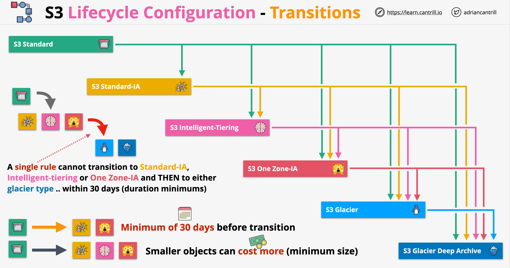

# Amazon S3 (Simple Storage Service):
- Object Storage service via HTTP/S.
- You cannot modify an object in S3: you need to overwrite it.
- Consistency:
	- new objects: strong read-after-write consistency.
	- replaced objects: eventual consistency.
- Buckets:
	- A bucket is a container for objects. 
	- An S3 bucket name is globally unique across all AWS accounts. 
	- A Bucket resides in only one region.
- Objects:
	- An object is a file with any metadata that describes that file.
	- An object key is the unique identifier for an object within a bucket. 
	- The combination of a bucket, key, and version ID uniquely identify each object.
	- Every object in Amazon S3 can be uniquely addressed through the combination of the web service endpoint, bucket name, key, and optionally, a version. 
- HA: S3 data replicated across 3 AZs at least (except the One Zone-IA and RRS classes).
- Block Public Access option: to ensure that public access to all your S3 buckets and objects is blocked. This setting applies account-wide for all current and future buckets. 
- Supports events notifications. Targets: SNS, SQS & Lambda.
- Object Versioning option:
	- If disabled, S3 sets the value of the version ID to "null". 
	- If enabled, S3 automatically generates a unique version ID for every new object that is created or updated. 
	- Object versions that existed before you enable the versioning option keep their version ID as "null". 

# S3 Storage Classes:
- S3 Standard: low latency, high performance, high cost. Default class. No retrieval fees.
- S3 Reduced Redundancy (RRS): low availability (not recommended)
- S3 Standard-IA: Infrequent Access, same performance as S3-Standard, medium cost, min storage 30 days, retrieval fee.
- S3 One Zone-IA: Infrequent Access, stored only in one AZ 
- S3 Glacier: Archival, Retrieval fee, min storage 90 days, 3 retrieval speeds (from minutes to 12 hours).
- S3 Glacier Deep Archive: Archival, Retrieval fee, min storage 180 days, 2 retrieval speeds (12 or 24 hours). Internally uses S3 Glacier.
- S3 Intelligent-Tiering: automatically moving data to the most cost-effective access tier, without operational overhead. Min 30 days. No retrieval fees.

- **S3 Standards (default)**:
    - The objects are stored in at least 3 AZs
    - Provides eleven nines of availability
    - The replication is using MD5 file checks together with CRCs to detect object issues
    - When objects are stored in S3 using the API, a HTTP 200 OK response is provided
    - Billing: 
        - GB/month of data stored in S3
        - A dollar for GB charge transfer out (in is free)
        - Price per 1000 requests
        - No specific retrieval fee, no minimum duration, no minimum size
    - S3 standard makes data accessible immediately, can be used for static website hosting
    - Should be used for data frequently accessed
- **S3 Standard-IA**:
    - Shares most of the characteristics of S3 standard: objects are replicated in 3 AZs, durability is the same, availability is the same, first byte latency is the same, objects can be made publicly available
    - Billing:
        - It is more cost effective for storing data
        - Data transfer fee is the same as S3 standard
        - Retrieval fee: for every GB of data there is a retrieval fee, overall cost may increase with frequent data access
        - Minimum duration charge: we will be billed for a minimum of 30 days, minimum capacity of the objects being 128KB (smaller objects will be billed as being 128 KB)
        - Should be used for long lived data where data access is infrequent
- **S3 One Zone-IA**:
    - Similar to S3 standard, but cheaper. Also cheaper than S3 standard IA
    - Data stored using this class is only stored in one region
    - Billing:
        - Similar to S3 standard IA: similar minimum duration fee of 30 days, similar billing for smaller objects and also similar retrieval fee per GB
        - Same level of durability (if the AZ does not fail)
        - Data is replicated inside one AZ
    - Since data is not replicated between AZs, this storage class is not HA. It should be used for non-critical data or for data that can be reproduced easily
- **S3 Glacier**:
    - Same data replication as S3 standard and S3 standard IA
    - Same durability characteristics
    - Storage cost is about 1/5 of S3 standard
    - S3 objects stored in Glacier should be considered cold objects (should not be accessed frequently)
    - Objects in Glacier class are just pointers to real objects and they can not be made public
    - In order to retrieve them, we have to perform a retrieval process:
        - A job that needs to be done to get access to objects
        - Retrievals processes are billed
        - When objects are retrieved for Glacier, they are temporarily stored in standard IA and they are removed after a while. We can retrieve them permanently as well
    - Retrieval process types:
        - **Expedited**: objects are retrieved in 1-5 minutes, retrieval process being the most expensive
        - **Standard**: data is accessible at 3-5 hours
        - **Bulk**: data is accessible at 5-12 hours at lower cost
    - Glacier has a 40KB minimum billable size and a 90 days minimum duration for storage
    - Glacier should be used for data archival, where data can be retrieved in minutes to hours
- **S3 Glacier Deep Archive**:
    - Approximately 1/4 of the price of standard Glacier
    - Deep Archive represents data in a frozen state
    - Has a 40KB minimum billable data size and a 180 days minimum duration for data storage
    - Objects can not be made publicly available, data access is similar to standard Glacier class
    - Restore jobs are longer:
        - **Standard**: up to 12 hours
        - **Bulk**: up to 48 hours
    - Should be used for archival which is very rarely accessed
- **S3 Intelligent-Tiering**:
    - It is a storage class containing 4 different tiering a storage
    - Objects that are access frequently are stored in the Frequent Access tier, less frequently accessed objects are stored in the Infrequent Access tier. Objects accessed very infrequently will be stored in either Archive or Deep Archive tier
    -  We don't have to worry for moving objects over tier, this is done by the storage class automatically
    - Intelligent tier can be configured, archiving data is optional and can be enabled/disabled
    - There is no retrieval cost for moving data between frequent and infrequent tiers, we will be billed based on the automation cost per 1000 objects
    - S3 Intelligent-Tiering is recommended for unknown or uncertain data access usage
- Storage classes comparison:

|                                    | S3 Standard            |  S3 Intelligent-Tiering | S3 Standard-IA         | S3 One Zone-IA          | S3 Glacier              | S3 Glacier Deep Archive |
|------------------------------------|------------------------|-------------------------|------------------------|-------------------------|-------------------------|-------------------------|
| Designed for durability            | 99.999999999% (11 9's) | 99.999999999% (11 9's)  | 99.999999999% (11 9's) | 99.999999999% (11 9's)  | 99.999999999% (11 9's)  | 99.999999999% (11 9's)  |
| Designed for availability          | 99.99%                 | 99.9%                   | 99.9%                  | 99.5%                   | 99.99%                  | 99.99%                  |
| Availability SLA                   | 99.9%                  | 99%                     | 99%                    | 99%	                   | 99.9%                   | 99.9%                   |
| Availability Zones                 | ≥3                     | ≥3                      | ≥3                     | 1                       | ≥3                      | ≥3                      |
| Minimum capacity charge per object | N/A                    | N/A                     | 128KB                  | 128KB                   | 40KB                    | 40KB                    |
| Minimum storage duration charge    | N/A                    | 30 days                 | 30 days                | 30 days                 | 90 days                 | 180 days                |
| Retrieval fee                      | N/A                    | N/A                     | per GB retrieved       | per GB retrieved        | per GB retrieved        | per GB retrieved        |
| First byte latency                 | milliseconds           | milliseconds            | milliseconds           | milliseconds            | select minutes or hours | select hours            |
| Storage type                       | Object                 | Object                  | Object                 | Object                  | Object                  | Object                  |
| Lifecycle transitions              | Yes                    | Yes                     | Yes                    | Yes                     | Yes                     | Yes                     |

## S3 Lifecycle Configuration

- We can create lifecycle rules on S3 buckets which can move objects between tiers or expire objects automatically
- A lifecycle configuration is a set of rules applied to a bucket or a group of objects in a bucket
- Rules consist of actions:
    - Transition actions: move objects from one tier to another after a certain time
    - Expiration actions: delete objects or versions of objects
- Objects can not be moved based on how much they are accessed, this can be done by the intelligent tiering. We can move objects based on time passed
- By moving objects from one tier to another we can save costs, expiring objects also will help saving costs
- Transitions between tiers:

- Considerations:
    - Smaller objects cost more in Standard-IA, One Zone-IA, etc.
    - An objects needs to remain for at least 30 days in standard tier before being able to be moved to infrequent tiers (objects can be uploaded manually in infrequent tiers)
    - A single rule can not move objects instantly from standard IA to infrequent tiers and then to Glacier tiers. Objects have to stay for at least 30 days in infrequent tiers before being able to be moved by one rule only. In order ot overcome this, we can define 2 different rules

# S3 Object size:
- The total volume of data and number of objects you can store are unlimited. 
- Max size of an object is 5 TB.
- Max object upload in a single PUT is 5 GB. Beyond this, you need to use multipart upload. 

# S3 vs S3 Glacier naming:
- File Container: 	S3=Bucket, Glacier=Vault.
- File: 			S3=Object, Glacier=Archive.

# S3 Bucket options:
- Versioning.
- Cross Region Replication (CRR). Requires to activate versioning.
- Data lifecycle management.
- MFA delete
- Requester pays for the data transfers.
- Notification.

# S3 Access security:
- You can use Bucket policies (IAM resource policies) or ACLs.
- ACLs:
	- Each bucket and object has an ACL attached to it as a subresource.
	- An ACL defines which AWS accounts or groups are granted access and the type of access. 
	- ACLs grant basic read/write permissions to other AWS accounts. 
	- You can grant permissions only to other AWS accounts, but not to users in the same account.
	- ACLs are very limited options. It's better to use Bucket policies.
- Main use cases for ACLs:
	- An object ACL is the only way to manage access to objects that are not owned by the bucket owner.
	- Manage permissions at the object level for a large number of objects (Policies are limited in size).
	- Use bucket ACL to grant write permission to the Amazon S3 Log Delivery group to write access log objects to your bucket.

# S3 Bucket access URL:
- Direct Access: Amazon S3 supports two URL styles to access a bucket directly:
	- virtual-hosted-style: https://{bucket-name}.s3.{Region}.amazonaws.com/{key-name}
	- path-style: https://s3.{Region}.amazonaws.com/{bucket-name}/{key-name}
- S3 Access Point: 
	- Access points are named network endpoints that are attached to buckets.
	- Each access point enforces distinct permissions and network controls.
	- You can create multiple access points for a single bucket to manage access policies in different use cases instead of a single bucket policy that spans dozens or hundreds of use cases.
	- supports only virtual-host-style addressing.
	- Can be either accessed from Internet ("NetworkOrigin": "Internet") or from a VPC ("NetworkOrigin": "VPC" and you specify the VPC ID).
- S3://
	- Some AWS services require specifying an Amazon S3 bucket using the S3:// notation.
	- Format: s3://{bucket-name}/{key-name}

# S3 Presigned URLs:
- A presigned URL gives you access to the object identified in the URL for specified duration.
- When you create a presigned URL, you associate it with a specific action.
- Anyone using the URL will act on the object as if he were the original signing user. 
- Are ways to retrieve parts of objects instead of entire objects
- S3 can store huge objects (up to 5 TB)
- Retrieving a huge objects will take time and consume transfer capacity
- S3/Glacier provides services to access partial objects using SQL-like statements to select parts of objects
- Both S3 Select and Glacier selects supports the following formats: CSV, JSON, Parquet, BZIP2 compression for CSV and JSON

# S3 Replication:
- Replication enables automatic, asynchronous copying of objects across Amazon S3 buckets.
- Single or multiple destinations.
- Same or different accounts.
- Same or different region (SRR or CRR).
- Same or different storage class.
- Replication Time Control (RTC) feature enables SLA of 15 minutes for replication of 99.9% of objects during any billing month.
- Read access available for replicas.
- 2 types of replication are supported by S3:
    - Cross-Region Replication (CRR)
    - Same-Region Replication (SRR)
- Both types of replication support same account replication and cross-account replication
- If we configure cross-account replication, we have to define a policy on the destination account to allow replication from the source account
- We can create replicate all objects from a bucket or we can create rules for a subset of objects
- We can specify which storage class to use for an object in the destination bucket
- We can also define the ownership of the objects in the destination bucket. By default it will be the same as the owner in the source bucket
- Replication Time Control (RTC): if enabled ensures a 15 minutes replication of objects
- Replication consideration:
    - Replication is not retroactive: only newer objects are replicated after the replication is enabled
    - Versioning needs to be enabled for replication
    - Replication is one-way only
    - Replication is capable of handling objects encrypted with SSE-S3 and SSE-KMS. SSE-C is not supported for replication
    - Replication requires for the owner of source bucket needs permissions on the objects which will be replicated
    - System events will not be replicated
    - Any objects in the Glacier and Glacier Deep Archive will not be replicated
    - **Deletion are not replicated!**
- Replication use cases:
    - SRR:
        - Log aggregation
        - PROD and Test sync
        - Resilience with strict sovereignty
    - CRR
        - Global resilience improvements
        - Latency reduction

# Prefixes and S3 Performance:
- A prefix is a logical grouping of the objects in a bucket.
- The prefix value is similar to a directory name that enables you to store similar data under the same directory in a bucket.
- Can create a hierarchy. 
- You can chose your delimiter for the bucket, such as slash (/).
- S3 Request rates: 3,500 writes and 5,500 reads per second PER PREFIX!
- To parallelize reads/writes, use multiple prefixes.

# S3 Transfer Acceleration: 
- A bucket-level feature that enables fast, easy, and secure transfers of files over long distances between your client and an S3 bucket. 
- Takes advantage of the globally distributed edge locations in Amazon CloudFront. 
- As the data arrives at an edge location, the data is routed to Amazon S3 over an optimized network path. 
- Popular use cases:
	- Your customers upload to a centralized bucket from all over the world.
	- You transfer gigabytes to terabytes of data on a regular basis across continents.
	- You can't use all of your available bandwidth over the internet when uploading to Amazon S3.
- To access the bucket that is enabled for Transfer Acceleration, you must use the endpoint {bucket-name}.s3-accelerate.amazonaws.com. 
- You can use the Amazon S3 Transfer Acceleration Speed Comparison tool to compare accelerated and non-accelerated upload speeds across Amazon S3 Regions.

# S3 Encryption - Server-Side Encryption (SSE):
You have three mutually exclusive options, depending on how you choose to manage the encryption keys:
- Server-Side Encryption with S3-Managed Keys (SSE-S3).
- Server-Side Encryption with CMKs stored in KMS (SSE-KMS).
- Server-Side Encryption with Customer-Provided Keys (SSE-C).

### SSE-S3:
- Each object is encrypted with a unique key.
- Encrypts the key itself with a master key that it regularly rotates. 
- Uses AES-256.
- Users do not manage the key or key permission.

### SSE-KMS:
- S3 uses AWS KMS customer master keys (CMKs) to encrypt your Amazon S3 objects. 
- Encrypts only the object data. Any object metadata is not encrypted. 
- When you use SSE-KMS encryption with an S3 bucket, the AWS KMS CMK must be in the same Region as the bucket. 
- You can use the default AWS-managed CMK, or you can specify a customer-managed CMK that you have already created. 
- Users who have access to a bucket will not see the encrypted files if they do not have permissions to use the encryption key in KMS. So you need to manage the key permissions in KMS even if the key is an AWS-managed CMK.

### SSE-C:
- you manage the encryption keys and Amazon S3 manages the encryption, as it writes to disks, and decryption, when you access your objects. 
- Uses AES-256.
- The encryption key must be provided in every request.

Hosting a static website on S3:
- You can configure your bucket as a static website.
- Website endpoints are different from the endpoints where you send REST API requests. 
- You configure the index document for the website.
- HTTPS not supported.
- When using your own domain name, bucket names must match your domain name exactly.

# CORS in S3:
- About the CORS standard in general:
	- The same-origin policy is a browser security policy that restricts on-page scripts from accessing or posting data to resources from a different host, on a different port, or with a different protocol than the current page. These resources are called "Cross-Origin Resources".
	- The HTML document itself can access cross-origin resources. However, scripts cannot access cross-origin resources. This is because a script could send data while accessing a cross-origin resource.
	- CORS, or Cross Origin Resource Sharing, is a method of accessing cross-origin resources safely. 
	- With CORS, the browser first does a preflight OPTIONS request on the target server to check if the server accepts CORS. Then the browser sends the actual request with proper CORS headers. 
- For Web pages hosted on S3, you need to enable the CORS option on the target bucket that is referenced by your web page.

# Query in Place options in S3:
- S3 Select:
	- you can use simple SQL statements to filter contents of S3 objects and retrieve just the subset of data that you need. 
	- Works on objects stored in CSV, JSON, or Apache Parquet format.
	- Supports compressed objects in GZIP and BZIP2 for CSV and JSON.
	- supports server-side encrypted objects.
- Amazon Athena.
- Amazon Redshift Spectrum.

Query in Place options in S3 Glacier:
- S3 Glacier Select:
	- you can use simple SQL statements to filter contents of S3 objects and retrieve just the subset of data that you need. 
	- retrieved data is stored in S3.
	- Works only on uncompressed CSV files.
	- You need to create a Glacier Job to run the SQL request.

# S3 Batch Operations:
- A feature that you can use to automate the execution, management, and auditing of a specific S3 request or Lambda function across many objects stored in Amazon S3. 
- You can use S3 Batch Operations to automate replacing tag sets on S3 objects, updating access control lists (ACL) for S3 objects, copying storage between buckets, initiating a restore from Glacier to S3, or performing custom operations with Lambda functions.
- You should use S3 Batch Operations if you want to automate the execution of a single operation (like copying an object, or executing an AWS Lambda function) across many objects. 
- With S3 Batch Operations, you can, with a few clicks in the S3 console or a single API request, make a change to billions of objects without having to write custom application code or run compute clusters for storage management applications. 

# S3 Object Lock:
- Blocks object version deletion during a customer-defined retention period so that you can enforce retention policies as an added layer of data protection or for regulatory compliance.
- If a user attempts to delete an object before its "Retain Until Date" has passed, the operation will be denied.
- There are 2 types of retention period modes:
    - **Compliance mode**: 
        - Object can not be adjusted, deleted or overwritten. The retention period can not be reduced, the retention mode can not be adjusted even by the account root user
        - Should be used for compliance reasons
    - **Governance mode**:
        - Objects can not be adjusted, deleted or overwritten, but special permissions can be added to some identities to allow for the lock setting to be adjusted
        - This identities should have the `s3:BypassGovernanceRetention` permission
        - The governance mode can be overwritten when passing `x-amz-bypass-governance-retention:true` header (header is default for console ui)
- Two methods for locking in S3 Glacier:
	- Vault Access policy: can be modified.
	- Vault Lock policy: can be locked for compliance.
- S3 Object Legal Hold:
	- Prevents an object version from being overwritten or deleted.
	- Doesn't have an associated retention period and remains in effect until removed.
	- Legal holds can be freely placed and removed by any user who has the s3:PutObjectLegalHold permission. 

# S3 Monitoring options:
- CloudTrail Logs: 
	- provide a record of actions taken by a user, role, or an AWS service.
	- Data events incur a fee, in addition to storage of logs.
	- Speed of delivery: Data events every 5 mins; management events every 15 mins.
	- Log format: JSON.
- S3 Server Access Logs:
	- provide detailed records for the requests that are made to an S3 bucket or objects. 
	- Free.
	- Speed of delivery: Within a few hours.
	- Log format: unstructured log file.

# S3 Select and Glacier Select

- Are ways to retrieve parts of objects instead of entire objects
- S3 can store huge objects (up to 5 TB)
- Retrieving a huge objects will take time and consume transfer capacity
- S3/Glacier provides services to access partial objects using SQL-like statements to select parts of objects
- Both S3 Select and Glacier selects supports the following formats: CSV, JSON, Parquet, BZIP2 compression for CSV and JSON

# S3 Access Points

- Improves the manageability of objects when buckets are used for many different teams or they contain objects for a large amount of functions
- They simplify the process of managing access to S3 buckets/objects
- Rather than 1 bucket (1 bucket policy) access we can create many access points with different policies
- Each access point can be limited from where it can be accessed, and each can have different network access controls
- Each access point has its own endpoint address
- We can create access point using the console or the CLI using `aws s3control create-access-point --name < name > --account-id < account-id > --bucket < bucket-name >`
- Any permission defined on the access point needs to be defined on the bucket policy as well

# S3 Block Public Access

- The Amazon S3 Block Public Access feature provides settings for access points, buckets, and accounts to help manage public access to Amazon S3 resources
- The settings we can configure with the Block Public Access Feature are:
    - **IgnorePublicAcls**: this prevents any new ACLs to be created or existing ACLs being modified which enable public access to the object. With this alone existing ACLs will not be affected
    - **BlockPublicAcls**: Any ACLs actions that exist with public access will be ignored, this does not prevent them being created but prevents their effects
    - **BlockPublicPolicy**: This prevents a bucket policy containing public actions from being created or modified on an S3 bucket, the bucket itself will still allow the existing policy
    - **RestrictPublicBuckets**: this will prevent non AWS services or authorized users (such as an IAM user or role) from being able to publicly access objects in the bucket

# S3 Cost Saving Options

- S3 Select and Glacier Select: save in network a CPU cost by retrieving ony the necessary data
- S3 Lifecycle Rules: transition objects between tiers
- Compress objects to save space
- S3 Requester Pays:
    - In general, bucket owners pay for all Amazon S3 storage and data transfer costs associated with their bucket
    - With Requester Pays buckets, the requester instead of the bucket owner pays the cost of the request and the data download from the bucket
    - The bucket owner always pays the cost of storing data
    - Helpful when we want to share large datasets with other accounts
    - Requires a bucket policy
    - If an IAM role is assumed, the owner account of that role pays for the request!
