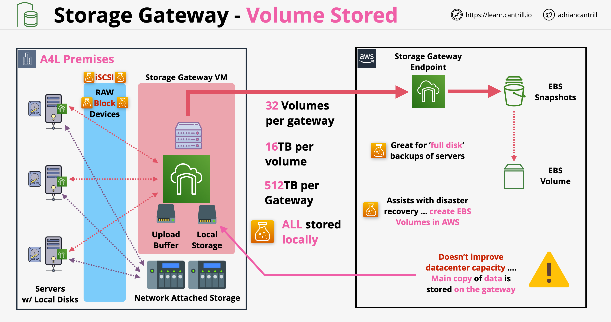
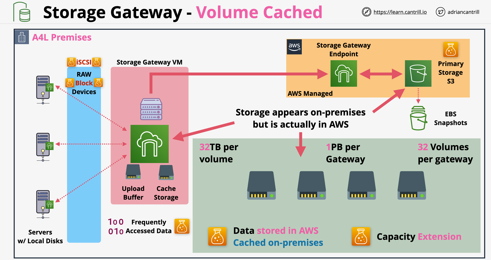
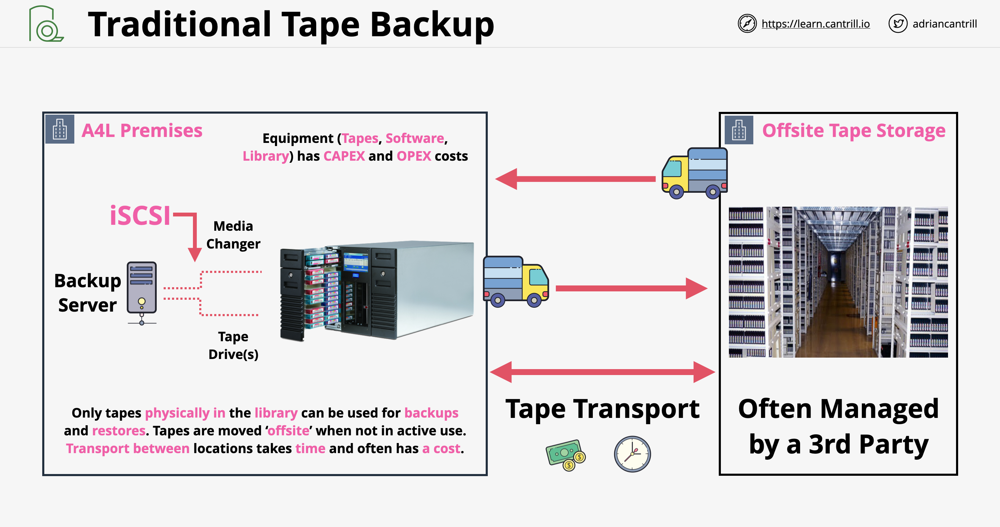
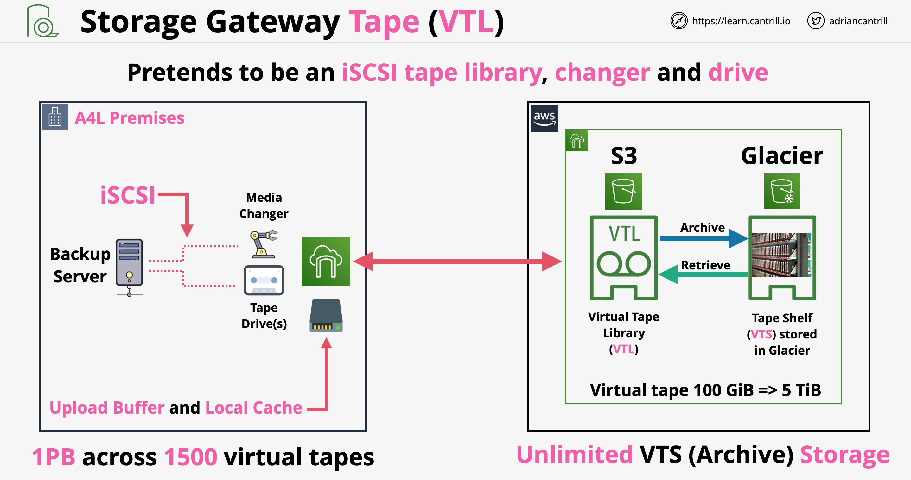
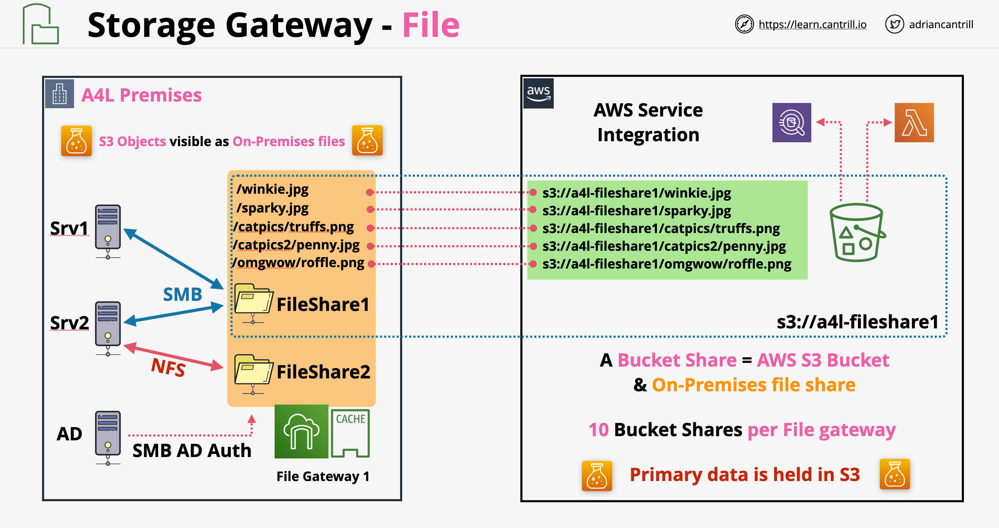

# AWS Storage Gateway:
- Appliance that offers file-based, volume-based, and tape-based storage solutions on prem.

## Volume Gateway
- S3-backed storage volumes that you can mount as iSCSI devices.
- Software Appliance. Supports ESXi, Hyper-V and KVM.
- Two volume types:
	- Cached Volumes: Cloud S3 volumes that are cached locally on the appliance. Up to 32 TB per volume.
	- Stored Volumes: Can store volumes locally on the appliance with snapshots to S3 (as EBS snapshots). Up to 16 TiB per volume.

- Offers 2 different types of operation:
    - Stored Mode:
        - The VM appliance presents volumes over iSCI to servers
        - Servers can create files systems on top of these volumes and use it in a normal way
        - These volumes consume capacity on-premises
        - Storage gateway has local storage, used as primary storage, everything is stored locally
        - Upload buffer: any data written to the local storage is also copied in the upload buffer and it will be uploaded to the cloud asynchronously via the storage gateway endpoint
        - The upload data is copied into S3 as EBS snapshots which can be converted into EBS volumes
        - It is great to do full disk backups, offering excellent RTO and RPO values
        - Stored Mode does not allow extending the data center capacity! The full copy of the data is stored locally
        
    - Cached Mode:
        - Cached Mode shares the same basic architecture with Stored Mode
        - The main location of data is no longer on-premises, it is on AWS S3
        - It has a local cache for the data only storing the frequently accessed data, the primary data will be in S3
        - The data will be stored in AWS managed area of S3, meaning it wont be visible using the AWS console. It can be viewed from the storage gateway console
        - The data is stored in raw block state
        - We can create EBS volumes out of the data
        - Cached Mode allows for an architecture know as data center extension
        

## Tape - VTL Mode

- VTL - Virtual Tape Library
- Examples of tape backups: LTO-9 Media which can hold 24TB raw data per tape
- Tape Loader (Robot): robot arm can insert/remove/swap tapes
- A Library is 1 ore more drives, 1 or more loaders and slots
- Traditional tape backup architecture:
    
- Storage Gateway Tape (VTL) Mode architecture:
    
- A Virtual tape can be from 100 GiB to 5 TiB
- A Storage Gateway can handle at max 1PB ot data across 1500 virtual tapes
- When virtual tapes are not used, they can be exported in the backup software marking them not being in the library (equivalent of ejecting them and moving them to the offsite storage)
- When exported, the virtual tape is archived in the Virtual Shelf which is backed by Glacier
- Cloud-backed VTL services
- Can run on-premises as a VM appliance, as a hardware appliance, or in AWS as an Amazon EC2 instance (for apps hosted on EC2). 
- Supports ESXi, Hyper-V and KVM.
- Virtual Tapes are backed by S3 with a local cache and buffer on the appliance.
- Virtual Tape Shelf (VTS) backed by S3 with choice of storage classes: GLACIER or DEEP_ARCHIVE

## File Mode

- A file interface into Amazon S3.
- Software appliance. Supports ESXi, Hyper-V and KVM.
- Provides file access with NFSv4 and SMB.
- Storage Gateway manages files in File Mode
- File Gateway bridges on-premises file storage and S3
- With File Gateway we create one or more mount points (shares) available via NFS or SMB
- File Gateways maps directly onto on S3 bucket above which we have visibility from the AWS console
- File Mode uses Read an Write Caching ensuring LAN-like performance
- File Gateway architecture:
    
- For Windows environments we can use AD authentication to access the File Gateway
- File Mode can be used for multiple contributors (multiple shares on-premises)
- `NotifyWhenUploaded`: API to notify other gateways when objects are changed
- File Gateway does not support any kind of object locking!
- The bucket backing the File Gateway can be used with CRR
- The lifecycle policies can also be used for files to be moved automatically between classes