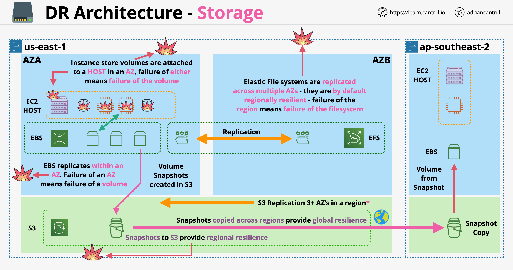
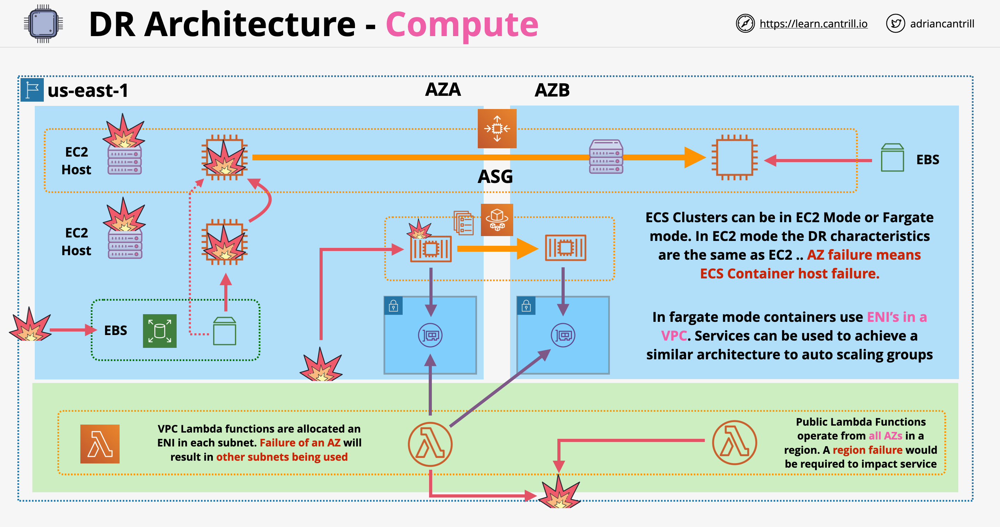
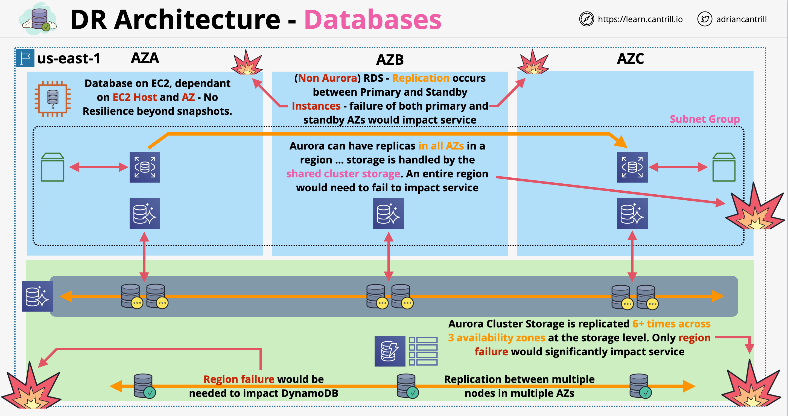
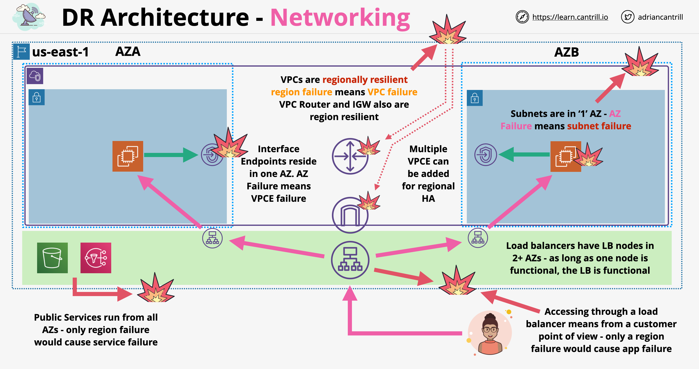

# DR/BC Architecture

- Effective DR/BC costs money all of the time
- We need some type of extra resources which will increase costs
- Executing disaster recover/business continuity process takes time. How long it takes depends on the type of DR/BC in usage
- DR/BC is trade-off between the time and costs

## Types of Disaster Recovery

- **Backup and Restore**:
    - Data is constantly backup up at the primary site
    - The only costs are backup media and management, no ongoing space infrastructure costs
    - Has little or no upfront costs, but implies a significant time for recovery
- **Pilot Light**:
    - Primary site is running at full
    - Pilot Light implies running a secondary environment only having the absolute minimum services running
    - In the event of a disaster the shutdown services can be spined up, no costs are expected to be inquired if there is no need for DR
- **Warm Standby**:
    - Primary site is running at full, everything is replicated on the backup site at a smaller scale
    - Ready to be increased in size when failover is required
    - It is faster than pilot light approach and cheaper than active/active approach
- **Active/Active (Multi-site):**
    - Primary site is entirely replicated on a secondary site
    - Data is constantly replicated from the primary site to the backup
    - Costs are generally 200%
    - There is no concept of recovery time
    - Additional benefits:
        - Load balancing across environments
        - Improved HA and performance
- Summary:
    - Backups: cheap and slow
    - Pilot Light: fairly cheap but faster
    - Warm Standby: costly, but quick to recover
    - Active/Active: expensive, 0 recovery time

## DR Architecture - Storage

- Instance Store volumes:
    - Most high risk form of storage available
    - If the host fails, the instance store volumes will also fail
    - Should be viewed as temporary and unreliable storage
- EBS:
    - Volumes are created an run in a single AZ (failure of AZ means failure of EBS volumes)
    - Snapshots of EBS are stored in S3, will increase reliability
- S3: 
    - Data is replicated across multiple AZs
    - One-Zone: not regionally resilient
- EFS:
    - EFS file systems are replicated across multiple AZs
    - They are by default regionally resilient - failure of a region means failure of EFS volumes
- DR Architecture - Storage:
    

## DR Architecture - Compute

- EC2:
    - If the host fails, EC2 instances fails as well
    - An EC2 instance by itself is not resilient in any way
    - If the failure is limited to one host, the instance can move to another host in the AZ. The EBS volume can be presented to the new instance
    - Auto Scaling Group: can be placed in multiple AZs, if the instance fails in one AZ, the ASG's role is to recreate them in another
- ECS:
    - Can run it 2 modes: EC2 and Fargate
    - EC2 mode: DR architecture is similar as above
    - Fargate mode: containers are running on a cluster host managed by AWS being injected in VPCs
    - Fargate can provide automatic HA by running things in different AZs
- Lambda:
    - By default runs in public mode
    - In VPC mode (private) Lambdas are injected in VPCs. If an AZ fails, Lambda can be automatically injected in another subnet in a different AZ
    - It will take the failure if a region in order for Lambda to be impacted
- DR Architecture - Compute:
    

## DR Architecture - Databases

- Running databases on EC2 should be done in certain cases only!
- DynamoDB:
    - Data is replicated between multiple nodes in different AZs
    - Failure can occur only if the entire region fails
- RDS:
    - Requires creation of a subnet group which specifies which subnet can be used in a VPC for a DB
    - Normal RDS (not Aurora) involves a single instance or primary and standby instance running in different AZs
    - Data is stored in local storage for each instance, data is replicated asynchronously to the standby
    - If the primary instance fails, automatic fallback is done to the standby
    - In case of Aurora, we can have one or more replicas in each AZs
    - Aurora uses a cluster storage architecture, storage is shared between running DB instances
    - Aurora can resist failures up to the entire region failure (not using Aurora Global)
- Global Databases:
    - DynamoDB Global Table: multi master replication between regional replicas.
    - Aurora Global Databases: read-write cluster in one region, secondary read cluster in other regions. Replication happens at the storage layer, no additional load placed on the DB
    - Cross Region Read Replicas for RDS: asynchronous replication but not done on the storage layer
- DR Architecture - Databases:
    

## DR Architecture - Networking

- Networking at local level:
    - VPC are regionally resilient
    - Certain gateway objects like VPC Router and IGW are also regionally resilient
    - Subnets are tied to AZ they are located in, if the AZ fails, the subnet fails as well
    - LB: regional services, nodes are deployed into each AZ we select
    - By using a LB we can route traffic to AZs which are healthy
- Interface endpoint:
    - Are tied to an AZ
    - Multiple interface endpoints can be deployed into different AZs
- DR Architecture - Networking:
    
- Global Networking:
    - Route53 can route globally to different regions (failover routing)