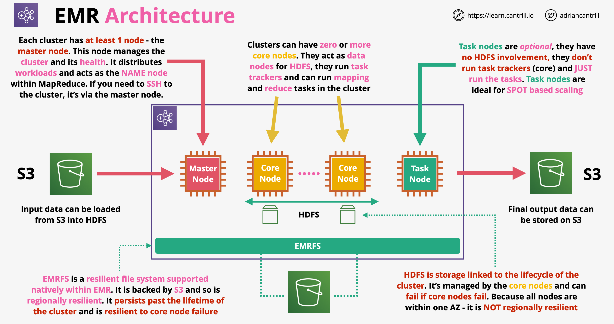

# Amazon Elastic MapReduce (EMR):
- A managed cluster platform that simplifies running big data frameworks, such as Apache Hadoop and Apache Spark, on AWS to process and analyze vast amounts of data. 
- When you launch your cluster, you choose the frameworks and applications to install for your data processing needs.
- A cluster is a collection of EC2 instances (called nodes) or an EKS cluster. 
- Amazon EMR also installs different software components on each node type, giving each node a role in a distributed application like Apache Hadoop. 
- Master node: A node that manages the cluster by running software components to coordinate the distribution of data and tasks among other nodes for processing. 
- Core node: A node with software components that run tasks and store data in the Hadoop Distributed File System (HDFS) on your cluster. 
- Task node: A node with software components that only runs tasks and does not store data in HDFS. Task nodes are optional.
- To process data in your Amazon EMR cluster, you can submit jobs or queries directly to installed applications, or you can run steps in the cluster. 
- Generally, when you process data in EMR:
	- The input is data stored as files in your file system, such as Amazon S3 or HDFS. 
	- This data passes from one step to the next in the processing sequence. 
	- The final step writes the output data to a specified location, such as an Amazon S3 bucket. 

## MapReduce 101

- Is a framework designed to allow processing huge amount of data in a parallel, distributed way
- Data Analysis Architecture: huge scale, parallel processing
- MapReduce has two main phases: map and reduce
- It also has to optional phases: combine and partition
- At high level the process of map reduce is the following:
    - Data is separated into splits
    - Each split can be assigned to a mapper
    - The mapper perform the operation at scale
    - The data is recombined after the operation is completed
- HDFS (Hadoop File System):
    - Traditionally stored across multiple data nodes
    - Highly fault-tolerant - data is replicated between nodes
    - Named Nodes: provide the namespace for the file system and controls access to HDFS
    - Block: a segment of data in HDFS, generally 64 MB

## Amazon EMR Architecture

- Is a managed implementation of Apache Hadoop, which is a framework for handling big data workloads
- EMR includes other elements such as Spark, HBase, Presto, Flink, Hive, Pig
- EMR can be operated long term, or we can provision ad-hoc (transient) clusters for short term workloads
- EMR runs in one AZ only within a VPC using EC2 for compute
- It can use spot instances, instance fleets, reserved and on-demand instances as well
- EMR is used for big data processing, manipulation, analytics, indexing, transformation, etc.
- EMR architecture:
    
    - Historically we could have only one master node, nowadays we can have 3 master nodes
    - Core nodes: they are used for tracking task, we don't want to destroy these nodes
    - Core nodes also managed to HDFS storage for the cluster. The lifetime of HDFS is linked to the lifetime of the core nodes/cluster
    - Task nodes: used to only run tasks. If they are terminated, the HDFS storage is not affected. Ideally we use spot instances for task nodes
    - EMRFS: file system backed by S3, can persist beyond the lifetime of the cluster. Offers lower performance than HDFS, which is based on local volumes

