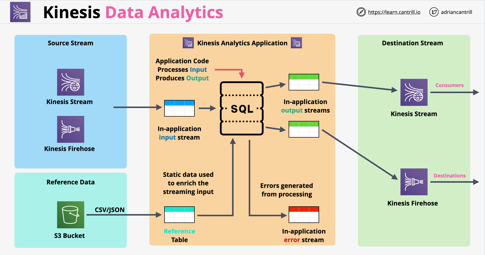

# Kinesis Stream family:
Kinesis Stream family:
- Kinesis Data Streams: Build custom applications that analyze data streams using popular stream-processing frameworks.
- Kinesis Data Firehose: Load data streams into data stores.
- Kinesis Data Analytics: Process and analyze streaming data using SQL or Java.
- Kinesis Video Streams: Capture, process, and store video streams for analytics and machine learning.

# Kinesis Data Streams:
- A Kinesis data stream is an ORDERED sequence of data records meant to be written to and read from in real time. 
- The producers continually push data to Kinesis Data Streams, and the consumers process the data in real time.
- The delay between the time a record is put into the stream and the time it can be retrieved (put-to-get delay) is typically less than 1 second. 
- Shards:
	- The data records in a data stream are distributed into shards. 
	- Each shard provides a processing capacity. 
	- You are charged on a per-shard basis. 
	- A single shard can ingest up to 1 MB of data/s or 1,000 records/s for writes.
	- Each shard can support up to 5 read transactions/s, up to a maximum total data read rate of 2 MB per second.
	- No auto scaling of the number of shards.
- Records:
	- Maximum size of data payload (Blob) of a record is 1 MB.
	- Each data record has a sequence number (assigned by the stream).
	- Data records are distributed into shards based on the Partition Key.
	- The Partition Key is specified by the applications putting the data into a stream.
- Records Retention:
	- Retention period: 24 hours by default, up to 365 days. 
	- When a shard is removed while having records, it stays in a "closed" state until the retention period ends.
- Producers:
	- Push records into streams using partition keys.
- Consumers:
	- Consumers get records in a Pull model over HTTP using GetRecords.
	- By default, a shard provides 2 MB/sec of read throughput per shard that is shared across all the consumers that are reading from that shard.
	- When you configure Lambda as a Consumer, the Lambda service will use one function concurrency per open shard.
- Enhanced fan-out consumers:
	- With this feature, each consumer gets its own 2 MB/sec allotment of read throughput, without contending for read throughput with other consumers. 
	- Kinesis Data Streams can push the records to you over HTTP/2 using SubscribeToShard. 
	- There is a data retrieval cost and a consumer-shard hour cost. 
- If you need to send stream records directly to services such as S3, Redshift or Splunk, it’s better to use Kinesis Data Firehose.
- Supports Server Side Encryption using AWS KMS.

# Kinesis Data Firehose:
- A fully managed service for delivering real-time streaming data to delivery streams for archiving and analysis purposes. 
- Firehose can accept data directly from producers or from Kinesis Data Streams
- Firehose receives the data in real-time, but the ingestion is buffered
- Data Firehose scales automatically, it is serverless and resilient
- It is not a real time product, it is a Near Real Time product with a deliver product of ~60 seconds
- Supports transformation of data on the fly using Lambda. This transformation can add latency
- Firehose is a pay as you go service, we pay per volume of dat
- Firehose buffer by default waits for 1MB of data in 60 seconds before delivering to consumer. For higher load, it will deliver every time there is an 1MB chunk of data
- Sources can be:
	- Your application pushing directly data into the delivery stream.
	- AWS services like AWS IoT, CloudWatch Logs and CloudWatch Events.
	- Kinesis Data Stream.
- Firehose supported destinations:
    - HTTP endpoints
    - Splunk
    - RedShift
    - ElasticSearch
    - S3
- Data Processing:
	- You can also configure Kinesis Data Firehose to transform your data before delivering it. 
	- Transformation is done using Lambda functions.
	- Supports a Lambda invocation time of up to 5 minutes. 
	- You can optionally convert data formats.
	- You can optionally store both original data and transformed data to S3.
- Supports records up to 1 MB.
- Stores data for up to 24 hours in case of delivery failure.
- Supports Server Side Encryption using AWS KMS.
- Data is sent directly form Firehose to destination, exception being Redshift, where data is stored in an intermediary S3 bucket
- Firehose use cases:
    - Persistence for data coming into Kinesis Data Streams
    - Storing data in a different format (ETL)

# Kinesis Data Analytics:
- Service to Process and analyze streaming data using SQL or Apache Flink.
- The service enables you to quickly author and run powerful SQL or Apache Flink code against streaming sources to perform time series analytics, feed real-time dashboards, and create real-time metrics. 
- Use cases:
	- Generate time-series analytics – You can calculate metrics over time windows, and then stream values to S3 or Redshift through a Kinesis data delivery stream.
	- Feed real-time dashboards – You can send aggregated and processed streaming data results downstream to feed real-time dashboards.
	- Create real-time metrics – You can create custom metrics and triggers for use in real-time monitoring, notifications, and alarms.
- Both the Streaming Source and the External destination can be either a Kinesis data stream or a Kinesis Data Firehose data delivery stream.
- You can optionally configure a reference data source to enrich your input data stream within the application. This data is loaded in a "reference table" inside the application.
- Application code:
	- A series of SQL statements that process input and produce output.
	- You can write SQL statements against in-application streams and reference tables. You can also write JOIN queries to combine data from both of these sources. 
- Data journey: Streaming Sources ==> In-application input streams ==> Application Code ==> In-application output streams ==> External destinations.
- It is a real-time data processing product using SQL
- The product ingests data from Kinesis Data Streams or Firehose
- After the data is processed, it can be sent directly to destinations such as:
    - Firehose (data becoming near-real time)
    - Kinesis Data Streams
    - AWS Lambda
- Kinesis Data Analytics architecture:
    
- Kinesis Data Analytics use cases:
    - Anything using stream data which needs real-time SQL processing
    - Time-series analytics: election data, e-sports
    - Real-time dashboards: leader boards for games
    - Real-time metrics

# Kinesis Video Streams:
- A fully managed AWS service that you can use to stream live video from devices to the AWS Cloud, or build applications for real-time video processing or batch-oriented video analytics. 
- Can capture massive amounts of live video data from millions of sources, including smartphones, security cameras, webcams, cameras embedded in cars, drones, and other sources.
- Can also capture non-video time-serialized data such as audio data, thermal imagery, depth data, RADAR data, and more. Uses Signaling channels.
- You use the AWS Kinesis Video Streams SDK to stream video to Kinesis.
- You can build applications that can access the data, frame-by-frame, in real time for low-latency processing. 
- You can Durably store, encrypt, and index data.
- Amazon Kinesis Video Streams with WebRTC: enables you to securely live stream media or perform two-way audio or video interaction between any camera IoT device and WebRTC-compliant mobile or web players. 

# SQS vs Kinesis Data Streams

- Is it about ingestion (Kinesis) of data or about decoupling, worker pools (SQS)
- SQS usually has 1 production group, 1 consumption group
- SQS is designed for decoupling and asynchronous communication
- SQS does not have the concept of persistence, no window for persistence
- Kinesis is designed for huge scale ingestion, having multiple consumers with different rate of consumption
- Kinesis is recommended for ingestion, analytics, monitoring, click streams
