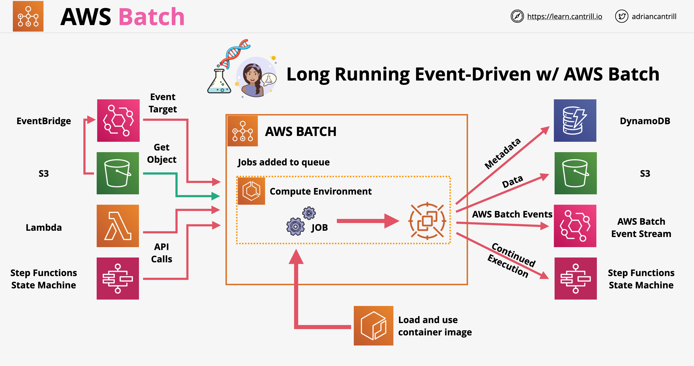

# AWS Batch:
- Regional service that helps you to run batch computing workloads on the AWS Cloud. 
- Sits in a VPC.
- Jobs: a unit of work (such as a shell script, a Linux executable, or a Docker container image)
- A Job runs as a containerized application on AWS Fargate or Amazon EC2 instances.
- Jobs can reference other jobs by name or by ID, and can be dependent on the successful completion of other jobs. 
- Job definition includes IAM role, CPU, Memory, container properties, environment variables, persistent storage, …
- Jobs are submitted to a Job Queue.
- You associate one or more compute environments with a job queue. You can set priorities.
- Managed Compute Environment: Fargate or EC2 (including Spot instances).
- Unmanaged Compute Environment: Batch creates an ECS cluster and you need to manage it (set up, scaling, …).
- Sensitive data stored in AWS Secrets Manager secrets can be exposed to an AWS Batch job as environment variables or as part of the log configuration
- Managed compute service commonly used for large scale data analytics and processing
- It is managed batch processing product
- Batch Processing: jobs that can run without end-user interaction, or can be scheduled to run as resources permit
- AWS Batch lets us worry about defining jobs, it will handle the underlying compute and orchestration
- AWS Batch core components:
    - Job: script, executable, docker container submitted to batch. Jobs are executed using containers in AWS. The job define the work. Jobs can depend on other jobs
    - Job Definition: metadata for a job, including IAM permissions, resource configurations, mount points, etc.
    - Job Queue: jobs are submitted to a queue, where they wait for compute environment capacity. Queues can have a priority
    - Compute Environment: the compute resources which do the actual work. Can be managed by AWS or by ourselves. We can configure the instance type, vCPU amount, spot price, or provide details on a compute environment we manage (ECS)
- Integration with other services:
    

## AWS Batch vs Lambda

- Lambda has a 15 minutes execution limit, for longer workflows we should use Batch
- Lambda has limited disk space in the environment, we can fix this by using EFS, but this would require the function to be run inside of a VPC
- Lambda is fully serverless with limited runtime selection
- Batch is not serverless, it uses Docker with any runtime
- Batch does not have a time limit for execution

# Managed vs Unmanaged AWS Batch

- Managed:
    - AWS manages capacity based on the workloads
    - We define the instance types, size and if we want to use on-demand or spot instances
    - We can determine our own max spot price
    - We need to create VPC gateways for access to the resources
- Unmanaged:
    - We manage everything
    - Generally used if we have a full compute environment ready to go