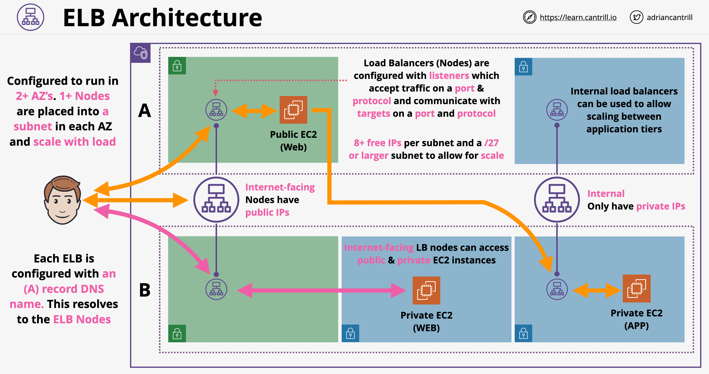

# Elastic Load Balancer (ELB):

## ELB Architecture

- It is the job of the load balancer to accept connection from an user base and distribute it to the underlying services
- ELBs support many different type of compute service
- LB architecture:

- Initial configurations for ELB:
    - IPv4 or double stacking (IPv4 + IPv6)
    - We have to pick the AZ which the LB will use, specifically we are picking one subnet in 2 or more AZs
    - When we pick a subnet, AWS places one or more load balancer nodes in that subnet
    - When an LB is created, it has a DNS A record. The DNS name resolves all the nodes located in multiple AZs. The nodes are HA: if the node fails, a different one is created. If the load is to high, multiple nodes are created
    - We have to decide on creation if the LB is internal or internet facing (have public IP addresses or not)
- Listener configuration: what the LB is listening to (what protocols, ports etc.)
- An internat facing load balancer can connect to both public and private instances
- Minimum subnet size for a LB is /28 - 8+ fee addresses per subnet (AWS suggests a minimum of /27)

## Cross-Zone Load Balancing

- Initially each LB node could distribute traffic to instances in the same AZ
- Cross-Zone Load Balancing: allows any LB node to distribute connections equally across all registered instances in all AZs

## User Session State

- Session state: 
    - A piece of server side information specific to one single user of one application
    - It does persist while the user interacts with the application
    - Examples of session state: shopping cart, workflow position, login state
- The date representing a sessions state is either stored internally or externally (stateless applications)
- Externally hosted session:
    - Session data is hosted outside of the back-end instances => application becomes stateless
    - Offers the possibility to do load balancing for the back-end instances, the session wont get lost in case the LB redirects the user to a different instance

## ELB Evolution

- Currently there are 3 different types of LB in AWS
- Load balancers are split between v1 and v2 (preferred)
- LB product started with Classic Load Balancers (v1)
- CLBs can load balance http and https and lower level protocols as well, although they can not understand the http protocol
- CLBs can have only 1 SSL certificates
- They can not be considered entirely being a layer 7 product
- Application Load Balancer (ALB - v2 LB) are layer 7 products supported HTTP(S) and WebSocket
- Network Load Balancers (NLB) are also v2 load balancers supporting lower level protocols such as TCP, TLC and UDP

# ELB 

ELB Load Balancer types in AWS:
- Application LB (ALB or ELBv2)
- Classic LB (ELBv1)
- Network NLB
- Gateway LB

LoadBalancer Comparison: https://aws.amazon.com/elasticloadbalancing/features/#Product_comparisons
- If you need flexible application management, we recommend that you use an Application Load Balancer.
- For network/transport protocols (layer4 – TCP, UDP) load balancing, and for extreme performance/low latency applications we recommend using Network Load Balancer.
- If you have an existing application that was built within the EC2-Classic network, then you should use a Classic Load Balancer.

# Application Load Balancer (ALB or ELBv2):
- Region wide LB, IPv4 or dual-stack.
- Layer 7 only.
- Supports HTTP/2, WebSockets and gRPC.
- Content based routing.
- Supports Cross-Zone Load Balancing (see below).
- « Request tracing » enabled by default.
- Backend targets can be EC2, ECS, Lambda, or any IP address.
- Target Groups:
	- Targets are grouped in Target Groups.
	- Target Groups are region-based.
	- A target can belong to multiple target groups.
	- An EC2 Auto Scaling group can belong to multiple target groups.
- Listeners:
	- Define port and protocol.
	- Each instance can have up to 10 listeners.
	- You can associate one or more target groups to a listener with a weighted distribution.
- Rules: 
	- Include conditions and corresponding actions if the conditions are satisfied. 
	- Supported conditions are: Host header, URL Path, HTTP headers, methods, query parameters, and source IP CIDRs. 
	- The supported actions are redirect, fixed response, authenticate, or forward. 
	- You can attach a default rule to a listener.
	- Can automatically do port mapping for containers.
	- The default algorithm is round robin; alternatively, you can specify the least outstanding requests routing algorithm. 
- Health checks (probes): HTTP(S). Supports custom HTTP response codes (200-499).
- User authentication with native OIDC or with Amazon Cognito. Cognito enables Social identities, Enterprise IdP (SAML) or consolidation of multiple OpenID Connect IdPs.
- Supports sessions Stickiness:
	- Target stickiness: configured in the target group.
	- Target Group stickiness: configured on the listener when you have multiple target groups. Can be set between 1 sec and 7 days.
- Supports deletion protection.
- Supports security groups.
- Encryption:
	- ALB supports HTTPS listeners for SSL/TLS offload.
	- HTTPS listeners are created with exactly one certificate, known as the default certificate. 
	- You can specify additional certificates in a certificate list.
	- Supports Server Name Indication (SNI).
	- Supports end-to-end encryption: traffic is re-encrypted between the ALB and the instances.
	- Certificates can be stored in AWS ACM or AWS IAM.
- Pricing based on hours and number of Loadbalancer Capacity Units (LCUs) used per hour.

# Classic LB:
- Region wide load balancer.
- Can be internal or external.
- L4 and some L7 capabilities.
- SSL offload.
- Cookie-based sticky session.
- Integrates with Auto Scaling.
- Health checks (probes): HTTP(S)/TCP/SSL. For HTTP(S), supports only a response code of 200.
- Integrates with CloudWatch for load balancing based on advanced metrics.
- Supported ports: 25, 80, 443, 1024-65535. 
- backend ports for a given service must be identical for all backend targets.
- Does not support Elastic IPs, works only with DNS.
- Integrates with Route 53.
- Supports IPv4 and IPv6
- Can log security to CloudTrail,
- Only one SSL certificate per ELB: cannot have certificates for www.acme.com and app.acme.com on the same ELB.
- Wildcard certificates are supported (*.acme.com).
- By default, the load balancer distributes traffic evenly across the Availability Zones (unless you enable « cross-zone load balancing »).
- Supports Connection Draining.
- Billed based on the bandwidth and hourly usage.
- Supports end-to-end encryption: traffic is re-encrypted between the LB and the instances.

# Network Load Balancer (NLB):
- Layer 4 only LB (TCP/UDP),
- Target types: IP, instance.
- Can handle millions of requests per second,
- Encryption:
	- TLS/SSL offload at scale.
	- Certificates from ACM or IAM.
	- Supports end-to-end encryption: traffic is re-encrypted between the LB and the instances.
- Selects a target using a flow hash algorithm based on the protocol, source IP address, source port, destination IP address, destination port, and for TCP, the TCP sequence number. 
- Support for static IP addresses for the load balancer (one per AZ). You can also assign one Elastic IP address per subnet enabled for the load balancer. Supports BYOIP.
- Support for registering targets by IP address, including targets outside the VPC for the load balancer.
- Can automatically do port mapping for containers. 
- Health checks at the target group level.
- Active health checks:
	- The load balancer periodically sends a request to each registered target to check its status.
	- Support HTTP, HTTPS, and TCP.
	- HTTP response code must be 200 to 399. 
- Passive health checks:
	- The load balancer observes how targets respond to connections.
	- Supported on TCP only.
	- You cannot disable, configure, or monitor passive health checks. 
- Client IP preservation:
	- When you specify targets by instance ID, the client IP of all incoming traffic is preserved and provided to your applications.
	- When you specify targets by IP address, you can choose to enable or disable client IP preservation.
- Supports deletion protection.
- Supports Cross-Zone Load Balancing.
- Does not support Security Groups.

# Gateway Load Balancer (GLB):
- Layer 3 only LB,
- enable you to deploy, scale, and manage virtual appliances, such as FWs, IPS and DPI systems.
- Target types: IP, instance.
- Exchanges traffic with backend targets using the GENEVE protocol,
- Max MTU: 8500 bytes,
- No SSL offload.
- You deploy the GLB in the same VPC as the target virtual appliances. 
- use Gateway Load Balancer endpoints to securely exchange traffic across VPC boundaries. 
- Support deletion protection.
- Supports Cross-Zone Load Balancing.

ELB Cross-Region Load Balancing:
- When you enable an Availability Zone for your load balancer, Elastic Load Balancer creates a load balancer node in the Availability Zone. 
- With an ALB however, it is a requirement that you enable at least two AZs.
- When clients send requests Amazon Route 53 responds to each request with the IP address of one of the load balancer nodes.
- When cross-zone load balancing is disabled, each load balancer node distributes traffic only across the registered targets in its Availability Zone. 
- When cross-zone load balancing is enabled, each load balancer node distributes traffic across the registered targets in all enabled Availability Zones. 
- Pros:
	- You get an even distribution of traffic across instances in all AZs.
	- If all instances in one AZ fail, ELB does not need to remove the ELB node IP address from Route 53 (which can take time to propagate to clients).
- Cons:
	- You get charged for cross-AZ traffic.
	- In case of NLB: You won't have micro-second latency with cross-AZ traffic.

ELB with Auto Scaling Group:
- You can attach the load balancer to your Auto Scaling group to register the group with the load balancer. 
- Instances that are launched/terminated by your Auto Scaling group are automatically registered/deregistered with the load balancer. 
- You can configure your Auto Scaling group to use ELB metrics such as the ALB request count per target (or other metrics) to scale the number of instances in the group.
- You can also optionally enable Auto Scaling to replace instances based on health checks provided by the ELB.

ELB Security policies:
- The SSL negotiation configuration in ELB is known as a security policy,
- A security policy is a combination of protocols and ciphers. 
- For ALB:
	- You can use either the default security policy or one of the other predefined security policies (to disable for example an SSL version).
	- You cannot create a custom security policy.
- For other ELBs, you can create a custom security policy.

# Session Stickiness

- Stickiness: allows us to control which backend instance to be used for a given connection
- With no stickiness connections are distributed across all backend services
- Enabling stickiness:
    - CLB: we can enable it per LB
    - ALB: we can enable it per target group
- When stickiness is enabled, the LB generates a cookie: `AWSALB` which is delivered to the end-user
- This cookie has a duration defined between 1 sec and 7 days
- When the user accesses the LB, it provides the cookie to the LB
- The LB than can decide to route the connection to the same backend instance every time while the cookie is not expired
- Change of the backed instance if the cookie is present:
    - If the instance to which the cookie maps to fails, then a new instance will be selected
    - If the cookie expires => the cookie will be removed, new cookie is created while a new instance is chosen
- Session stickiness problems: load can become unbalanced