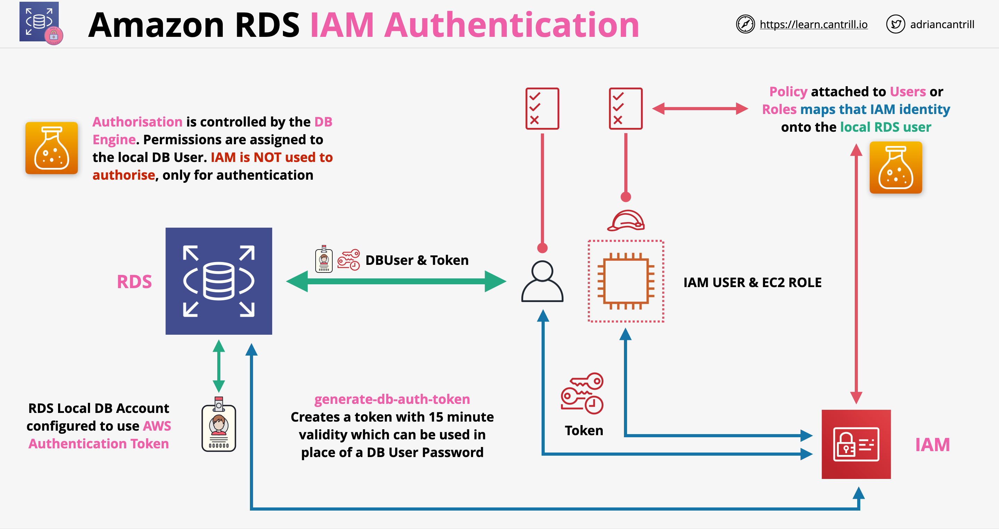

# Relational Database Service (RDS)
- Relational DB PaaS (almost PaaS).
- Supported engine options: MySQL, PostgreSQL, Oracle, Microsoft SQL, MariaDB, Amazon Aurora.
- each DB engine has a set of parameters in a DB parameter group that control the behavior of the databases that it manages. 
- Multi-AZ: synchronous replica in secondary AZ.
- ACID Compliance: transactions must be ACID compliant or be Atomic, Consistent, Isolated and Durable (ACID) to ensure data integrity.
- Billing options: on-demand and reserved instance.
- Bring your own licenses supported on Oracle.
- Automated or manual backups.
- Automated or manual upgrades.
- Can be placed in a VPC to have control on the network and security.

### RDS Instance Class:
- Instance class = performance tier (CPU, RAM).
- Three types of instance classes: Standard, Memory Optimized, and Burstable Performance. 
- You can change the CPU and memory available to a DB instance by changing its DB instance class. 
- You can control the number of CPU cores and threads for each CPU core to optimize on Licensing costs.

RDS Storage:
- DB instances for RDS use EBS volumes for database and log storage.
- Storage options: Magnetic (standard), GP-SSD (gp2) or PIOPS (io1).

### RDS Multi AZ

- Used to add resilience to an RDS instance
- Multi AZ is an option which can be enabled on an RDS instance, when enabled secondary hardware is allocated in another AZ (standby replica)
- RDS enables synchronous replication between primary and standby instances
- RDS is accessed via provided endpoint address (CNAME)
- With a single instance the endpoint address points the instance itself, with multi AZ, by default the endpoint points to the primary instance
- We can not directly access the standby instance
- If an error occurs with the primary instance, RDS automatically changes the endpoint to point to the standby replica. This failover occurs in around 60-120 seconds
- Multi AZ is not available in the Free-tier (generally costs double as it would the single AZ)
- Backups are taken from the standby instance (removes performance impact)
- Failovers can happen if:
    - AZ outage
    - Primary instance failure
    - Manual failover
    - Instance type change
    - Software patching
- Synchronous replica in secondary AZ. Master-Standby relationship.
- The standby replica is invisible.
- DB snapshots taken against the replica instance.
- AWS manages DNS for failover.
- Multi-AZ is different from an RDS read replica.

### RDS Read-Replicas

- Provide 2 main benefits: performance and availability
- Read replicas are read-only replicas of an RDS instance
- Read replicas can be used for reading only data
- The primary instance and read replica is kept sync using asynchronous replication
- There can be a small amount of lag in case of replication
- Read replicas can be created in a different AZ or different region (CRR - Cross-Region Replication)
- We can 5 direct read-replicas per DB instance
- Each read-replica provides an additional instance of read performance
- Read-replicas can also have read-replicas, but lag starts to be a problem in this case
- Read-replicas can provide global performance improvements
- Snapshots and backups improve RPO but not RTO. Read-replicas offer near 0 RPO
- Read-replicas can be promoted to primary in case of a failure. This offers low RTO as well (lags of minutes)
- Read-replicas can replicate data corruption
- Read only instance, for load offloading.
- Created from a snapshot of the master instance.
- Asynchronous replication.
- Up to 5 read replicas to each DB Instance.
- Same or different AZ. Same or different region.
- Read Replicas in a different region is supported only on MariaDB, MySQL, Oracle, or PostgreSQL. Not supported on MS-SQL.
- For MS SQL, the source DB instance must be a Multi-AZ deployment with Always On Availability Groups (AGs). This is an Enterprise Edition feature.
- For some DB engines, you can transform a read replica to a normal independent instance: promote to master.

### RDS Scaling:
- Performance scaling: manual. You can change the instance class (scale up) or use read replicas (read scale out).
- Storage scaling: automatic.

### RDS Reserved Instances (RI):
- You can reserve based on a fixed combination of:
	- DB engine
	- instance class
	- Deployment type
	- License model (included or BYOL)
	- Region
- If you change any of the above options, the pricing will revert to normal consumption based (on-demand).
- RIs can be moved between AZs in the same region.
- Support multi-AZ deployments
- Can be applied to Read Replicas (same DB instance class and Region).

### RDS Database Authentication options:
- Password authentication: internal DB users. The DB admin creates users with SQL statements.
- IAM database authentication: 
	- Uses standard AWS IAM authentication. 
	- Supported on MySQL and PostgreSQL. 
	- An authentication token is used to connect to the DB. 
- Kerberos authentication: RDS databases (except MariaDB) support Kerberos and Microsoft AD authentication and SSO.

### RDS Encryption:
- RDS encrypts the DB instance, all logs, backups, and snapshots using an AWS KMS CMK.
- You can also use Transparent Data Encryption (TDE) with RDS for Oracle and RDS for SQL Server.
- TDE automatically encrypts data before it is written to storage, and automatically decrypts data when the data is read from storage. 
- Oracle TDE:
	- A feature available in Oracle Enterprise Edition.
	- You can choose to encrypt the whole table or just some columns.

### RDS Automated Backups:
- Automated daily incremental volume snapshot of your entire DB instance (VM), not just the DBs. 
- Backups are stored in Amazon S3. 
- Automated backups occur daily during the preferred backup window. 
- If you don't specify a preferred backup window, RDS assigns a default 30-minute backup window that is selected at random from an 8-hour block of time for each AWS Region. 
- Retention: Up to 35 days. Default: 1 day. 
- Deleting an RDS instance deletes the automated snapshots but not the manual snapshots.
- RDS uploads transaction logs for DB instances to Amazon S3 every 5 minutes. RPO is therefore 5mn.

### RDS Restore:
- You cannot restore to an existing instance.
- Customized DB parameters and SGs are not restored.
- RDS combines daily backups with transaction logs to restore the DB instance (point-in-time recovery).
- You can Restore up to the last five minutes.
- Third party backup and restore process and options are different.

## RDS Monitoring:
- CloudWatch:
	- Metrics collected from the hypervisor of a DB instance.
	- Standard Monitoring, CPU utilization.
- Enhanced Monitoring:
	- Metrics collected from an agent on the instance. 
	- Looks at metrics in real time for the operating system.
	- Useful when you want to see how different processes or threads on a DB instance use the CPU. 
	- After you have enabled Enhanced Monitoring for your DB instance, you can view the metrics for your DB instance using CloudWatch Logs.
- Performance Insights:
	- Metrics collected from inside the DB engine itself.
	- Expands on existing Amazon RDS monitoring features to illustrate your database's performance and help you analyze any issues that affect it. 
	- With the Performance Insights dashboard, you can visualize the database load and filter the load by waits, SQL statements, hosts, or users. 
- RDS event notification:
	- You can subscribe to an event category for a DB instance, DB snapshot, DB parameter group, or DB security group.
	- You can create multiple subscriptions for the same DB instances if you want to process differently some event categories.
	- Notifications are sent using AWS SNS. SNS can then invoke a Lambda function for example.

## Data Security

- With all the RDS engines we can use encryption in transit (SSL/TLS). THis can be set to be mandatory
- For encryption at rest RDS supports EBS volume encryption using KMS which is handled by the host EBS and it is invisible for the database engine
- We can use customer managed or AWS generated CMK data keys for encryption at rest
- Storage, logs and snapshots will be encrypted with the same customer master key
- Encryption can not be removed after it is activated
- In addition to encryption at rest MSSQL and Oracle support TDE (Transparent Data Encryption) - encryption at the database engine level
- Oracle supports TDE with CloudHSM, offering much stronger encryption
- IAM authentication with RDS:
    - Normally login is controlled with local database users (username/password)
    - We can configure RDS to allow IAM authentication (only authentication, not authorization, authorization is handled internally!):
    

