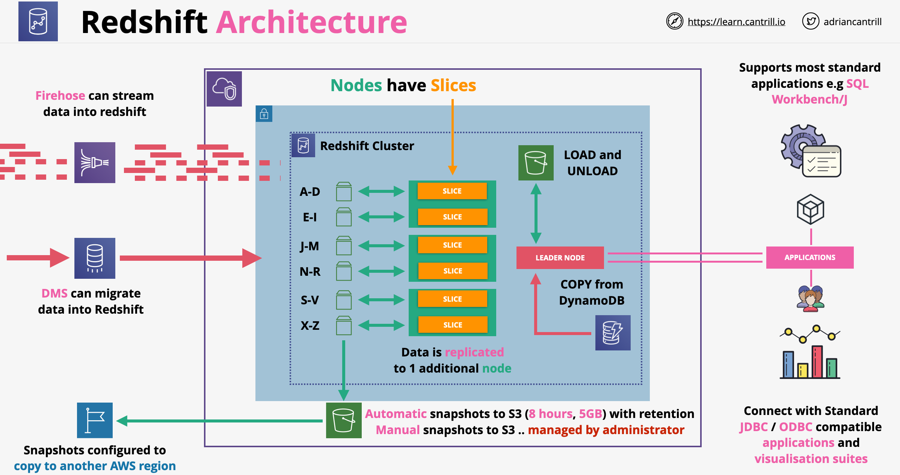
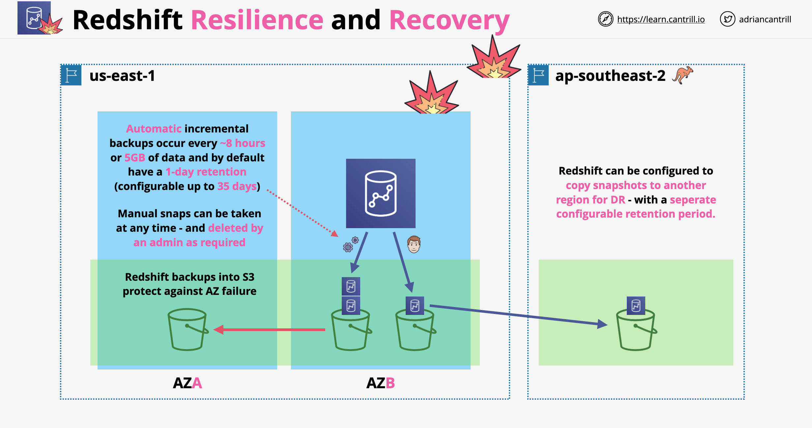

# Amazon RedShift:
- Fully managed petabyte-scale relational data warehouse service.
- It is designed for reporting and analytics
- It is an OLAP (column based) database, not OLTP (row/transaction)
    - OLTP (Online Transaction Processing): capture, stores, processes data from transactions in real-time
    - OLAP (Online Analytical Processing): designed for complex queries to analyze aggregated historical data from other OALP systems
- HDD and SSD platforms.
- Wide integrations with existing tools.
- Architecture:
	- Leader Node: Simple SQL end point, stores metadata, coordinates query execution.
	- Compute Nodes: Local columnar storage, parallel execution of queries, loads, backups, restores and resizes.
	- You select the instance types for your nodes.
	- Lives inside a VPC.
- Redshift workload management (WLM): enables users to manage priorities within workloads so that short, fast-running queries won't get stuck in queues behind long-running queries. WLM assigns the query to a queue according to the user's group.
- Enhanced VPC Routing feature:
	- If not enabled, Redshift routes traffic through the internet, including traffic to other services within the AWS network. 
	- If enabled, Redshift forces all COPY and UNLOAD traffic between your cluster and your data repositories through your VPC.
	- If enabled, you can use features such as ACLs, VPC endpoints, internet gateway, DNS.
- Redshift Can load encrypted data from S3.
- Supports Encryption at Rest and in Transit (SSL).
- Supports VPC Security Groups.
- Snapshots:
	- Manual or Automated.
	- Redshift stores these snapshots internally in Amazon S3
	- Supports Cross-Region snapshots. 
- Regulatory compliance.
- Redshift architecture:
    

## Redshift Components
-  **Cluster**: a set of nodes, which consists of a leader node and one or more compute nodes
    - Redshift creates one database when we provision a cluster. This is the database we use to load data and run queries on your data
    - We can scale the cluster in or out by adding or removing nodes. Additionally, we can scale the cluster up or down by specifying a different node type
    - Redshift assigns a 30-minute maintenance window at random from an 8-hour block of time per region, occurring on a random day of the week. During these maintenance windows, the cluster is not available for normal operations
    - Redshift supports both the EC2-VPC and EC2-Classic platforms to launch a cluster. We create a cluster subnet group if you are provisioning our cluster in our VPC, which allows us to specify a set of subnets in our VPC
- **Redshift Nodes**:
    - The leader node receives queries from client applications, parses the queries, and develops query execution plans. It then coordinates the parallel execution of these plans with the compute nodes and aggregates the intermediate results from these nodes. Finally, it returns the results back to the client applications
    - Compute nodes execute the query execution plans and transmit data among themselves to serve these queries. The intermediate results are sent to the leader node for aggregation before being sent back to the client applications
    - Node Type:
        - Dense storage (DS) node type – for large data workloads and use hard disk drive (HDD) storage
        - Dense compute (DC) node types – optimized for performance-intensive workloads. Uses SSD storage
- **Parameter Groups**: a group of parameters that apply to all of the databases that we create in the cluster. The default parameter group has preset values for each of its parameters, and it cannot be modified

## Redshift Resilience and Recovery

- Redshift can use S3 for backups in the form a snapshots
- There are 2 types of backups:
    - Automated backups: occur every 8 hours or after every 5 GB of data, by default having 1 day retention (max 35). Snapshots are incremental
    - Manual snapshots: performed after manual triggering, no retention period
- Restoring from snapshots creates a brand new cluster, we can chose a working AZ to be provisioned into
- We can copy snapshots to another region where a new cluster can be provisioned
- Copied snapshots also can have retention periods

## Amazon Redshift Workload Management (WLM) 

- Enables users to flexibly manage priorities within workloads so that short, fast-running queries won’t get stuck in queues behind long-running queries
- Amazon Redshift WLM creates query queues at runtime according to service classes, which define the configuration parameters for various types of queues, including internal system queues and user-accessible queues
- From a user perspective, a user-accessible service class and a queue are functionally equivalent

# Amazon Redshift Spectrum:
- Enables you to query and retrieve structured and semistructured data from files in Amazon S3 without having to load the data into Amazon Redshift tables.
- Redshift Spectrum queries employ massive parallelism to execute very fast against large datasets. Much of the processing occurs in the Redshift Spectrum layer, and most of the data remains in Amazon S3.
- Multiple clusters can concurrently query the same dataset in Amazon S3 without the need to make copies of the data for each cluster. 
- Redshift Spectrum can potentially use thousands of instances to take advantage of massively parallel processing. 
- You create Redshift Spectrum tables by defining the structure for your files and registering them as tables in an external data catalog. The external data catalog can be AWS Glue, the data catalog that comes with Amazon Athena, or your own Apache Hive metastore. 
